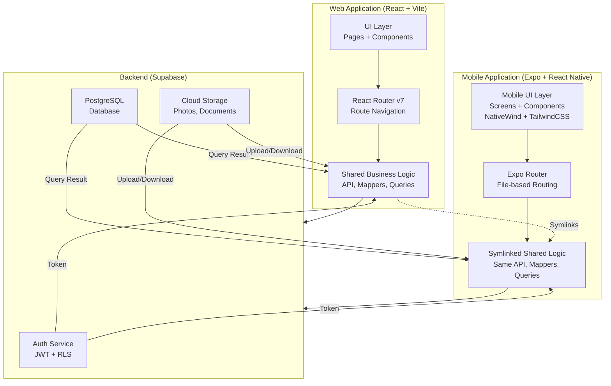

# Techwheels Mobile Architecture & Code Structure

**Document Type**: Architecture Reference  
**Target Audience**: Development team  
**Last Updated**: 2026-05-27

---

## Architecture Overview



---

## 🎯 Project Structure (IMPORTANT CLARIFICATION)

**Your Project Root** = `/Users/vkbin/Techwheels-Service/`
- This is the **WEB APPLICATION** (existing React + Vite project)
- Web code lives in: `src/` (pages, components, routing, etc.)
- Web shared logic lives in: `src/lib/` (API modules, mappers, queries, types)

**Mobile Application** = New `/Users/vkbin/Techwheels-Service/mobile/` folder
- Mobile code will live in: `mobile/app/` (screens, components)
- Mobile will **SYMLINK** to web's shared logic: `mobile/lib/ → ../src/lib/`

**NO SEPARATE `/web` FOLDER** ✅ (root itself is the web version)

---

## Directory Structure

### Root Level
```
/Users/vkbin/Techwheels-Service/
├── src/                              # ✅ EXISTING WEB APP
│   ├── App.tsx                       # Web routing + navigation
│   ├── main.tsx                      # Web entry point
│   ├── pages/                        # 8 web pages
│   │   ├── LoginPage.tsx
│   │   ├── SignUpPage.tsx
│   │   ├── ImportPage.tsx
│   │   ├── ReportsPage.tsx
│   │   ├── AutoDocPage.tsx
│   │   ├── AdminPage.tsx
│   │   ├── SettingsPage.tsx
│   │   └── reports/                 # Report components
│   ├── lib/                          # 🔗 SHARED LAYER
│   │   ├── api/                      # 12 API modules (symlinked to mobile)
│   │   │   ├── auth.ts
│   │   │   ├── vehicles.ts
│   │   │   ├── jobCards.ts
│   │   │   ├── panels.ts
│   │   │   ├── photos.ts
│   │   │   ├── documents.ts
│   │   │   ├── estimate.ts
│   │   │   ├── activityLog.ts
│   │   │   ├── email.ts
│   │   │   ├── autodocRates.ts
│   │   │   ├── rcLookup.ts
│   │   │   └── index.ts
│   │   ├── *ColumnMapper.ts          # 8 column mappers (symlinked)
│   │   ├── reportQueries.ts          # Report queries (symlinked)
│   │   ├── partsReportQueries.ts     # Parts queries (symlinked)
│   │   ├── database.types.ts         # TS types (symlinked)
│   │   ├── supabase.ts               # Supabase client
│   │   ├── autodocStorage.ts         # Storage layer
│   │   ├── columnMatcher.ts          # CSV column matching (symlinked)
│   │   ├── employeeMatcher.ts        # Employee matching (symlinked)
│   │   ├── branches.ts               # Branch utilities (symlinked)
│   │   ├── exportUtils.ts            # Export helpers (symlinked)
│   │   ├── getTableColumns.ts        # Column utilities (symlinked)
│   │   └── generators/               # Report generators
│   │       ├── generateExcel.ts
│   │       └── generatePPT.ts
│   ├── context/                      # React context (some symlinked)
│   │   └── DirtyContext.tsx          # Form dirty state
│   ├── hooks/                        # React hooks (some symlinked)
│   │   ├── useReportData.ts
│   │   ├── useOnline.ts
│   │   └── useLastUpdated.ts
│   ├── components/                   # Web components
│   └── assets/                       # Web assets
├── mobile/                           # 🆕 NEW MOBILE APP
│   ├── app/                          # Expo Router (file-based)
│   │   ├── _layout.tsx               # Root layout + auth check
│   │   ├── (auth)/                   # Auth screens group
│   │   │   ├── _layout.tsx
│   │   │   ├── login.tsx
│   │   │   ├── signup.tsx
│   │   │   └── password-reset.tsx
│   │   ├── (tabs)/                   # Authenticated screens group
│   │   │   ├── _layout.tsx           # Bottom tab navigation
│   │   │   ├── import/
│   │   │   │   ├── index.tsx         # Import screen
│   │   │   │   └── [type].tsx        # Import detail (optional)
│   │   │   ├── reports/
│   │   │   │   ├── index.tsx         # Reports list
│   │   │   │   └── [id].tsx          # Report detail
│   │   │   ├── autodoc/
│   │   │   │   ├── index.tsx         # Job card list
│   │   │   │   ├── [id]/             # Job card detail group
│   │   │   │   │   ├── _layout.tsx
│   │   │   │   │   ├── index.tsx     # Job card detail
│   │   │   │   │   ├── panels.tsx    # Panel carousel
│   │   │   │   │   ├── photos.tsx    # Photo upload
│   │   │   │   │   ├── documents.tsx # Document management
│   │   │   │   │   ├── estimate.tsx  # Estimate entry
│   │   │   │   │   └── activity.tsx  # Activity log
│   │   │   ├── settings/
│   │   │   │   ├── index.tsx         # Settings screen
│   │   │   │   └── [id].tsx          # Employee detail
│   │   │   └── admin/
│   │   │       └── index.tsx         # Admin dashboard
│   ├── components/                   # Mobile-specific components
│   │   ├── auth/
│   │   │   ├── LoginForm.tsx
│   │   │   ├── SignUpForm.tsx
│   │   │   └── PasswordResetForm.tsx
│   │   ├── import/
│   │   │   ├── ImportTypeSelector.tsx
│   │   │   ├── FileUploadCard.tsx
│   │   │   ├── ProgressIndicator.tsx
│   │   │   └── ConflictResolution.tsx
│   │   ├── reports/
│   │   │   ├── ReportCard.tsx
│   │   │   ├── ChartComponent.tsx    # Victory Native charts
│   │   │   ├── FilterPanel.tsx
│   │   │   └── ExportButton.tsx
│   │   ├── autodoc/
│   │   │   ├── JobCardList.tsx
│   │   │   ├── JobCardDetail.tsx
│   │   │   ├── PanelCarousel.tsx     # Swipeable panels
│   │   │   ├── PhotoUpload.tsx       # Camera + gallery
│   │   │   ├── DocumentUpload.tsx
│   │   │   ├── EstimateForm.tsx
│   │   │   ├── ActivityLog.tsx
│   │   │   └── StatusBadge.tsx
│   │   ├── settings/
│   │   │   ├── EmployeeList.tsx
│   │   │   ├── EmployeeSearch.tsx
│   │   │   └── UserProfile.tsx
│   │   ├── admin/
│   │   │   ├── UserManagement.tsx
│   │   │   ├── ModulePermissions.tsx
│   │   │   └── DealerAssignment.tsx
│   │   └── common/
│   │       ├── Button.tsx
│   │       ├── Input.tsx
│   │       ├── Card.tsx
│   │       ├── Modal.tsx
│   │       ├── LoadingSpinner.tsx
│   │       └── ErrorBoundary.tsx
│   ├── context/                      # Mobile contexts
│   │   ├── AuthContext.tsx           # Auth state + session
│   │   ├── DirtyContext.tsx          # 🔗 Symlinked from web
│   │   ├── PermissionContext.tsx     # Module permissions
│   │   └── index.ts
│   ├── hooks/                        # Mobile-specific hooks
│   │   ├── useCamera.ts              # Expo Camera
│   │   ├── useMediaLibrary.ts        # Expo ImagePicker
│   │   ├── useDocumentPicker.ts      # Expo DocumentPicker
│   │   ├── useReportData.ts          # 🔗 Adapted from web
│   │   ├── useOnline.ts              # 🔗 Adapted from web
│   │   ├── useLastUpdated.ts         # 🔗 Adapted from web
│   │   ├── useOfflineQueue.ts        # Pending uploads
│   │   └── index.ts
│   ├── lib/                          # 🔗 SHARED CODE LAYER
│   │   ├── api/                      # 🔗 Symlink to ../src/lib/api
│   │   ├── *ColumnMapper.ts          # 🔗 Symlinks
│   │   ├── reportQueries.ts          # 🔗 Symlink
│   │   ├── partsReportQueries.ts     # 🔗 Symlink
│   │   ├── database.types.ts         # 🔗 Symlink
│   │   ├── supabase.ts               # Mobile adaptation (AsyncStorage)
│   │   ├── autodocStorage.ts         # Mobile adaptation (AsyncStorage)
│   │   ├── columnMatcher.ts          # 🔗 Symlink
│   │   ├── employeeMatcher.ts        # 🔗 Symlink
│   │   ├── branches.ts               # 🔗 Symlink
│   │   ├── exportUtils.ts            # 🔗 Symlink
│   │   ├── getTableColumns.ts        # 🔗 Symlink
│   │   └── utils.ts                  # Export helper
│   ├── assets/                       # Mobile-specific assets
│   │   ├── icon.png                  # App icon
│   │   ├── splash.png                # Splash screen
│   │   └── ...
│   ├── package.json                  # Includes all web + mobile deps
│   ├── app.json                      # Expo configuration
│   ├── eas.json                      # EAS build config
│   ├── tailwind.config.ts            # Tailwind for mobile
│   ├── babel.config.js               # Babel + NativeWind
│   ├── tsconfig.json                 # TypeScript config
│   ├── expo-env.d.ts                 # Expo type definitions
│   └── README.md
│
├── package.json                      # Web package.json
├── vite.config.ts                    # Web Vite config
├── docs/
│   └── Implementation_plans/
│       ├── MOBILE-001_EXPO_IMPLEMENTATION_PLAN.md        # 📄 THIS PLAN
│       ├── MOBILE-002_EXECUTION_CHECKLIST.md             # 📋 CHECKLIST
│       ├── MOBILE-003_ARCHITECTURE.md                    # 📐 ARCH (this file)
│       └── completed/
└── ...
```

---

## Code Sharing Strategy

### Symlinked Files (Zero Duplication)

| Source File | Mobile Link | Purpose |
|------------|------------|---------|
| `src/lib/api/` | `mobile/lib/api` | All 12 API modules |
| `src/lib/*ColumnMapper.ts` | `mobile/lib/` | CSV column mapping (8 files) |
| `src/lib/reportQueries.ts` | `mobile/lib/` | General report SQL |
| `src/lib/partsReportQueries.ts` | `mobile/lib/` | Parts report SQL |
| `src/lib/database.types.ts` | `mobile/lib/` | Supabase TypeScript types |
| `src/lib/columnMatcher.ts` | `mobile/lib/` | Header inference |
| `src/lib/employeeMatcher.ts` | `mobile/lib/` | Employee matching |
| `src/lib/branches.ts` | `mobile/lib/` | Branch utilities |
| `src/lib/exportUtils.ts` | `mobile/lib/` | Export helpers |
| `src/lib/getTableColumns.ts` | `mobile/lib/` | Column utilities |
| `src/context/DirtyContext.tsx` | `mobile/context/` | Form dirty tracking |

### Adapted Files (Mobile-Specific)

| File | Web Version | Mobile Version | Changes |
|------|------------|-----------------|---------|
| `supabase.ts` | localStorage + cookies | AsyncStorage (mobile-optimized) | Session persistence |
| `autodocStorage.ts` | IndexedDB | AsyncStorage | Offline caching |
| `useReportData.ts` | React hooks | Adapted hooks | Mobile data fetching |
| `useOnline.ts` | Web APIs | React Native APIs | Network detection |
| **NEW: `utils/`** | Web calculation utils | Same + mobile upload | Zustand stores, Drive uploads |
| **NEW: `store/`** | N/A | Zustand with persist | State management (from ref project) |

---

## API Layer Specification

### 12 API Modules (Shared)

#### 1. **auth.ts** - Authentication
```ts
export async function login(email: string, password: string)
export async function signup(email: string, password: string)
export async function resetPassword(email: string)
export async function updatePassword(newPassword: string)
export async function logout()
export async function getSession()
```

#### 2. **vehicles.ts** - Vehicle Management
```ts
export async function getVehicles(dealerCode: string)
export async function getVehicle(id: string)
export async function upsertVehicle(vehicle: Vehicle)
export async function lookupRC(regNumber: string)
```

#### 3. **jobCards.ts** - Job Card CRUD
```ts
export async function getJobCards(filters: JobCardFilter)
export async function getJobCard(id: string)
export async function createJobCard(data: JobCardCreate)
export async function updateJobCard(id: string, data: JobCardUpdate)
export async function transitionStatus(id: string, newStatus: string)
```

#### 4. **panels.ts** - Panel Management
```ts
export async function getPanels(jobCardId: string)
export async function addPanel(jobCardId: string, panel: Panel)
export async function removePanel(panelId: string)
```

#### 5. **photos.ts** - Photo Upload
```ts
export async function uploadPhoto(jobCardId: string, photo: File)
export async function getPhotos(jobCardId: string)
export async function deletePhoto(photoId: string)
```

#### 6. **documents.ts** - Document Management
```ts
export async function uploadDocument(jobCardId: string, doc: File)
export async function getDocuments(jobCardId: string)
export async function deleteDocument(docId: string)
```

#### 7. **estimate.ts** - Estimate Creation
```ts
export async function createEstimate(jobCardId: string, data: EstimateCreate)
export async function updateEstimate(id: string, data: EstimateUpdate)
export async function getEstimate(jobCardId: string)
```

#### 8. **activityLog.ts** - Activity Tracking
```ts
export async function logActivity(action: string, entityId: string)
export async function getActivityLog(entityId: string)
```

#### 9. **email.ts** - Email Notifications
```ts
export async function sendJobCardEmail(jobCardId: string, to: string)
export async function sendEstimateEmail(estimateId: string, to: string)
```

#### 10. **autodocRates.ts** - Rate Lookup
```ts
export async function getRates(filters: RateFilter)
export async function updateRates(rates: Rate[])
```

#### 11. **rcLookup.ts** - RC Validation
```ts
export async function validateRC(regNumber: string)
export async function lookupRCDetails(regNumber: string)
```

#### 12. **types.ts** - Shared Types
```ts
export type Database = { ... }
export type JobCard = { ... }
export type Panel = { ... }
export type Vehicle = { ... }
export type User = { ... }
export type PermissionRow = { ... }
```

---

## Component Hierarchy

### Web (React + Vite)
```
App.tsx (Router + Navigation)
├── LoginPage / SignUpPage (Auth)
├── ImportPage
├── ReportsPage
│   ├── ReportChart (Recharts)
│   └── ReportTable
├── AutoDocPage
│   └── JobCardPanel
├── AdminPage
├── SettingsPage
└── (nested pages + components)
```

### Mobile (Expo + React Native - Reference Project Pattern)
```
_layout.tsx (Root Layout + Auth Wrapper)
├── (auth) [Auth Group]
│   ├── _layout.tsx
│   ├── login.tsx
│   ├── signup.tsx
│   └── reset-password.tsx
├── (main) [Authenticated Group]
│   ├── _layout.tsx (Bottom tabs navigation)
│   ├── index.tsx (Dashboard)
│   ├── import/
│   │   ├── index.tsx
│   │   └── [type].tsx
│   ├── reports/
│   │   ├── index.tsx
│   │   └── [id].tsx
│   ├── autodoc/
│   │   ├── index.tsx (Job card list)
│   │   └── [id]/ (Job card detail group)
│   │       ├── index.tsx
│   │       ├── panels.tsx
│   │       ├── photos.tsx
│   │       ├── documents.tsx
│   │       └── estimate.tsx
│   ├── settings/index.tsx
│   └── admin/index.tsx
└── Providers (Zustand stores, Auth context, Supabase client)
```

**Pattern Benefit**: Grouped routes `(auth)` and `(main)` provide clean layout nesting (from reference project).

---

## Data Flow & Authentication

### Authentication Flow
```
1. User enters credentials on mobile
2. Mobile calls: supabase.auth.signInWithPassword(email, password)
3. Supabase returns JWT token
4. Token stored in AsyncStorage (mobile) / localStorage (web)
5. Every API call includes Authorization header: Bearer <token>
6. Supabase RLS policies enforce dealer scoping
7. Token auto-refreshes on expiry (handled by Supabase client)
```

### API Call Flow (Example: Get Job Cards)
```
Mobile Component
    ↓
useReportData() hook
    ↓
mobile/lib/api/jobCards.ts
    ↓
supabase.from('job_cards').select(...)
    ↓
Supabase RLS policy (dealer_code check)
    ↓
PostgreSQL query
    ↓
Return data → Component → UI
```

### File Upload Flow (Example: Photo)
```
User taps camera → useCamera() hook
    ↓
Expo Image Picker → Returns asset
    ↓
Compress with Expo ImageManipulator
    ↓
mobile/lib/api/photos.ts uploadPhoto()
    ↓
Supabase Storage → /job_cards/{jobCardId}/photos/
    ↓
Store reference in documents table
    ↓
Update UI with success message
```

---

## Performance Considerations

### Bundle Size Optimization
- **APK Size Target**: < 150 MB (compressed)
- **Strategy**: Pre-bundle all dependencies, enable ProGuard on Android
- **OTA Updates**: Only push app code changes, not dependencies

### Startup Time
- **Target**: < 3 seconds
- **Optimization**: 
  - Lazy load routes (Expo Router supports this)
  - Cache Supabase session in AsyncStorage
  - Pre-load critical data on app start

### Report Load Time
- **Target**: < 2 seconds
- **Optimization**:
  - Implement pagination for large datasets
  - Use Victory Native (lightweight charting)
  - Debounce filter changes

### Photo Upload
- **Target**: < 10 seconds
- **Optimization**:
  - Compress images to 80% quality
  - Upload in background
  - Show progress indicator

---

## Security Considerations

### Authentication & Authorization
- ✅ JWT stored securely in AsyncStorage (mobile-specific)
- ✅ Token auto-refresh on expiry
- ✅ RLS policies enforce dealer scoping
- ✅ Module permissions checked at UI layer (with API-layer backup)

### Data Encryption
- ✅ HTTPS for all API calls (Supabase enforces)
- ✅ Supabase Storage encryption at rest
- ✅ File encryption optional (configurable)

### Sensitive Data
- ✅ Passwords never logged
- ✅ API keys in environment variables (`.env.local`)
- ✅ Session tokens in AsyncStorage (not localStorage)

---

## Testing Strategy

### Unit Tests (Jest)
```ts
// Test column mappers
describe('openJobCardsColumnMapper', () => {
  test('maps CSV row to JobCard', () => { ... })
})

// Test report queries
describe('reportQueries', () => {
  test('generates correct SQL', () => { ... })
})

// Test API helpers
describe('employeeMatcher', () => {
  test('matches employee records', () => { ... })
})
```

### Integration Tests
```ts
// Test with actual Supabase instance (staging)
describe('Job Card API', () => {
  test('creates job card', async () => { ... })
  test('enforces RLS', async () => { ... })
})
```

### E2E Tests
```ts
// Test full user flows
describe('User Flow: Import → Reports', () => {
  test('Login → Import CSV → View Report', async () => { ... })
})
```

---

## Deployment Pipeline

### Development Workflow
```
1. Feature branch on GitHub
2. Code review + merge to main
3. Local testing with Expo Go
4. EAS Preview build for QA
5. Test on real devices
6. EAS Production build
7. OTA update published
```

### Build Process
```
eas build --platform android --profile preview
  ↓
EAS servers build APK with all dependencies bundled
  ↓
Download APK (50-100 MB)
  ↓
Test locally or distribute internally
  ↓
When ready: eas submit --platform android
```

### OTA Update Process
```
1. Modify app code (not dependencies)
2. Commit to GitHub
3. expo publish (or use EAS Updates CLI)
4. Users get notification on app open
5. App updates in background
```

---

## Migration Path from Web to Mobile

### Phase 1: Shared Code Extraction
- Identify reusable business logic
- Move to `src/lib/` (done)
- Expose via clean API layer (done)

### Phase 2: Symlink Setup
- Create `mobile/lib/` folder
- Symlink all shared files
- Adapt Supabase client for mobile

### Phase 3: UI Reimplementation
- Build mobile screens (NOT copy web)
- Use React Native components
- Apply mobile-centric UX patterns

### Phase 4: Testing
- Unit test shared logic
- Integration test APIs
- E2E test critical flows

### Phase 5: Deployment
- Build APK via EAS
- Distribute via Expo Go or stores
- Monitor crash reports

---

## Maintenance & Updates

### Regular Maintenance
- **Weekly**: Monitor crash reports
- **Bi-weekly**: Apply security patches
- **Monthly**: Major feature updates
- **Quarterly**: Dependency updates

### OTA Update Strategy
- **Critical bugs**: Push immediately
- **Minor features**: Weekly cadence
- **New major features**: Coordinate with marketing

### Deprecation Policy
- Support current + 2 previous minor versions
- Prompt users to update after 3 months

---

## Success Metrics

- ✅ 100% feature parity with web version
- ✅ < 3 second app startup time
- ✅ < 0.5% crash rate on production
- ✅ < 10 second average report load time
- ✅ 90%+ successful uploads
- ✅ > 85% test coverage for shared logic

---

**Document Status**: DRAFT  
**Last Updated**: 2026-05-27  
**Next Review**: After Phase 2 completion
