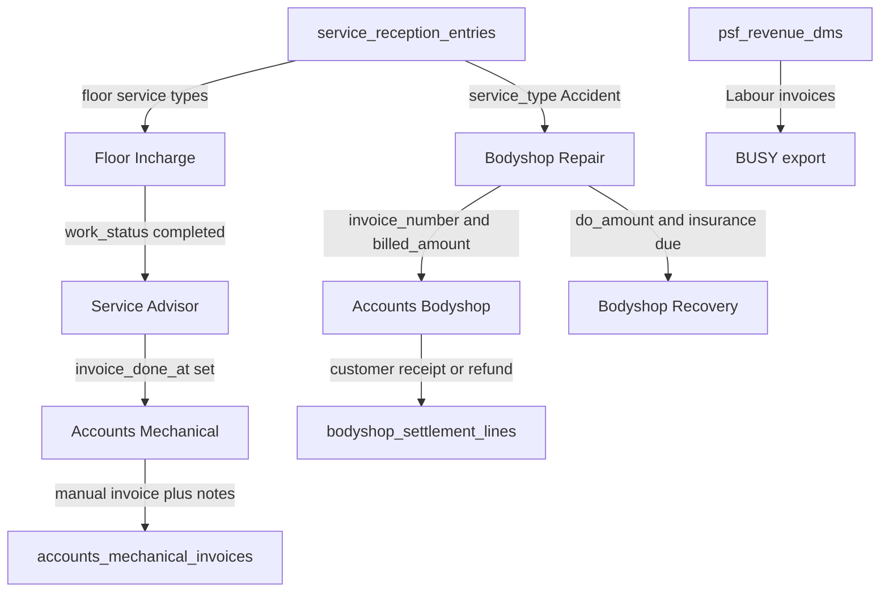

# ACCOUNTS-001: Mechanical and Bodyshop Accounts Desk

**Plan ID:** ACCOUNTS-001  
**Created:** 2026-09-11  
**Last Updated:** 2026-09-12  
**Priority:** HIGH  
**Owner:** Accounts + Platform Team  
**Status:** Active (web implemented; DBL-0055 Accounts DO post pending apply)  
**Platform:** webversion  
**Category:** accounts  
**Ledger:** DBL-0045/0046/0051/0052/0053/0054/0056 APPLIED. DBL-0055 PROPOSED (Accounts may post insurer/DO lines). Do not reuse DBL-0043 (`busy`) or DBL-0044 (`busy_parts`).  
**Route:** `/accounts`  
**Module:** `accounts`  
**Depends on:** BODYSHOP-SETTLEMENT-001 (`bodyshop_settlements`, Stage 18 lines); Service Advisor Mark Done (`invoice_done_at`)  
**Related (do not merge):** BODYSHOP-RECOVERY-001 (insurance-due follow-up book); BUSY-001 (`/busy` DMS Labour export)  
**Audit baseline:** HEAD `8c76f16` after rebase onto `fcbbd01`. Schema authority: `supabase/backups/full_metadata.sql`.

---

## Executive Summary

Add a top-level **Accounts** desk at `/accounts` with two sections. **Mechanical** lists Floor Incharge service types after Service Advisor **Mark Done**, then Accounts captures invoice number, billed amount, and payment notes. **Bodyshop** lists Repair Tracker cases that already have invoice number and billed amount so Stage 18 can post **both** insurer/DO receipts and customer-diff receipts on the existing `bodyshop_settlements` / `bodyshop_settlement_lines` ledger.

This is not `/busy` (BUSY Party/Invoice export). `/bodyshop-recovery` remains the insurance-due follow-up book. Accounts is an additional authorized posting surface for actual money receipts. Both write the same ledger; there is no second payment store.

**Risk Level:** MEDIUM  
**Estimated Duration:** 2–3 days  
**Rollback Strategy:** Revert DBL-0055 `can_post_do` / list columns and the `accounts_receipt` variant. Leave `bodyshop_settlements`, Recovery, and Mechanical payment lines untouched.

---

## Objectives

1. Register RBAC module `accounts` and route `/accounts` without colliding with `busy` or `invoices`.
2. Show Mechanical cases only after Mark Done on floor service types; let Accounts enter invoice number, billed amount, and payment notes.
3. Show Bodyshop cases when invoice number and billed amount exist; post Stage 18 insurer/DO and customer-diff receipts from this page onto the existing settlement ledger.
4. Keep Recovery insurance-due listing, Repair Tracker invoice/DO capture, SA Mark Done, and BUSY export unchanged.

---

## Context & Background

There is no `/accounts` page today. Mechanical completion is `service_reception_entries.invoice_done_at` (Mark Done). That flag has no invoice number or billed amount. Bodyshop money lives on `bodyshop_settlements` / `bodyshop_settlement_lines`. Recovery lists `insurance_due_amount > 0` only. After 2026-09-11 rebase, Recovery shows Customer / Policy / CP via a client-side join and `do_payment` can also post CP. That does not replace a customer-diff queue.

BODYSHOP-SETTLEMENT-001 Phase 7 Task 7.1 (dedicated `/accounts` queue) and BODYSHOP-RECOVERY-001 Task 3.1 (customer remaining book) are owned by this plan.

**Locked product decisions**

- v1 is a full desk, not view-only.
- Mechanical money is **manual Save**. Capture may **Fetch from DMS** into the form (invoice number, date, billed = `total_invoice_amount`) when exactly one live `psf_revenue_dms` row exists. Do not auto-write remaining or receipts. Do not auto-join `job_card_closed_data`.
- Do not change Mark Done, Floor Incharge, Repair Tracker invoice/DO capture, Recovery list filter, or BUSY.



---

## Locked rules (v1)

1. Nav label **Accounts**. Module `accounts`. Route `/accounts`. Top-level nav beside BUSY / Reports — not inside the Bodyshop dropdown, not a BUSY tab.
2. Grant by named user in Admin → Permissions (`accounts` view). View is enough to list, capture mechanical, and post customer. No Employee Master business role.
3. Org-wide visibility. No dealer/branch/fuel filter.
4. Mechanical row = `is_floor_incharge_service_type` + `invoice_done_at IS NOT NULL` + non-empty `jc_number` + `invoice_done_at >= 2026-09-11 00:00:00+05:30` (DBL-0053). Exclude Accident and Rusting. Pre-cutoff Mark Done cases stay in reception/Accounts invoice tables but are not listed.
5. Bodyshop row = non-blank `invoice_number` AND `invoice_amount` / `billed_amount` not null, settlement header exists, `overall_status <> cancelled`. Do **not** require `insurance_due_amount > 0`. Do **not** apply the Mechanical 11-Sep cutoff (DBL-0054).
6. Default Bodyshop filter = customer remaining pending (`due`/`refund` and status not `received`). Toggle All billed / Received. `kind = none` only under All billed.
7. Settlement panel: Accounts uses `variant="accounts_receipt"` — Section A DO/insurance lump-sum receipt (existing `postDoRelease` / MAIN path) + Section B customer-diff receipt. Do not reuse Recovery `do_payment` (Main/GST/TDS plus opportunistic CP). Do not upsert invoice/DO capture from Accounts.
8. Accounts users may post insurer/DO lines through `bodyshop_settlement_can_post_do` (DBL-0055). Recovery and Repair modify grants stay. Do not create a parallel permission helper.
9. Cancelled repairs are not Accounts Bodyshop rows.
10. Overall Payment Status is `derived_payment_status`. Do not show Received merely because the customer-diff side is received.

Floor Incharge types (authority: `src/lib/api/reception.ts` + `is_floor_incharge_service_type`): Running Repairs, First/Second/Third Free Service, Paid Service, Updation, E Breakdown, Campaign.

---

## Database changes (DBL-0045)

Do not reuse module `invoices` (id 2) or module `busy`. Do not re-run DBL-0026 / 0031–0037 / 0042 / 0043.

### A. `public.modules`

- `name = accounts`, `label = Accounts`, `route = /accounts`, `is_active = true`
- `sort_order` next to BUSY (BUSY is 29) — use 30 or the next free value at apply

### B. `public.accounts_mechanical_invoices` (1:1 reception entry)

- `reception_entry_id` unique FK to `service_reception_entries`
- denormalized `jc_number`
- `invoice_number` text, `invoice_date` date, `billed_amount` numeric(14,2)
- `payment_status` `pending` / `partial` / `received` / `not_received` default `pending`
- `amount_received` numeric(14,2) nullable
- `payment_notes` text
- `captured_by`, `captured_at`, `updated_at`
- RLS: authenticated direct writes denied; SELECT/write only via SECURITY DEFINER RPCs
- Do not add these money columns onto `service_reception_entries`

### C. RPCs

- `list_accounts_mechanical_cases()` — org-wide; floor types + `invoice_done_at`; left join invoice table
- `upsert_accounts_mechanical_invoice(...)` — requires `accounts` view/modify; validates Mark Done + floor type
- `list_accounts_bodyshop_cases()` — org-wide; invoice number + billed amount; return customer name, policy no, `customer_diff_amount`, `customer_remaining_amount`, `customer_posted_amount` (CP), kind, statuses. Do not rely on a second client join the way Recovery does today.
- `bodyshop_settlement_can_post_customer(repair_card_id)` — admin or `accounts` view/modify, org-wide
- `bodyshop_settlement_can_post_do(repair_card_id)` — admin, `accounts` view/modify, Recovery, or Repair modify (DBL-0055). `add_bodyshop_settlement_line` already uses this helper for MAIN/GST/TDS.

### D. Checks

Paired file under `supabase/sql_checks/`. After apply: refresh `full_metadata.sql`.

---

## Web UI

Pattern: `src/pages/BodyshopRecoveryPage.tsx` (KPIs, search, table, Excel, on-page post). Use Recovery labels: Customer, Policy, **Customer payment (CP)**.

**Wiring** (`src/App.tsx`, `src/components/TopNav.tsx`)

- Add `accounts` to `ModuleName`, `AppRoute`, `ROUTE_MODULE_MAP`, `NAV_ITEMS`
- Add `canAccessPath` prefix for `/accounts` next to `/busy`
- Update `docs/shared/reference/MODULE_ROUTE_CONTRACT.md` with an `accounts` row under `busy`

**Settlement panel** (`src/components/BodyshopSettlementPanel.tsx`)

- Extend variant to `'full' | 'do_payment' | 'customer_payment' | 'accounts_receipt'`
- `accounts_receipt`: hide Billing & DO capture; show Section A DO/insurance receipt + Section B customer-diff + complete settlement summary (invoice, DO, DO received/remaining, customer diff/received/remaining, outstanding, overall status)
- Recovery stays `do_payment`

**Page** `src/pages/AccountsPage.tsx` + `src/lib/api/accounts.ts`

- Tabs: Mechanical | Bodyshop
- Search: JC / reg / invoice
- Period chips on Mark Done date (mechanical) and invoice date (bodyshop)
- Excel export per section

**Mechanical desk**

- Columns: Mark Done at, JC, reg, model, service type, SA, branch, owner, invoice number, billed amount, payment status, notes
- Capture / Payments modal: invoice number, date, billed amount, and invoice file (reuse unused SA `invoice_storage_path` upload). **Fetch from DMS** fills those fields when the JC has exactly one live DMS invoice; Accounts still taps Save. 0 or 2+ DMS rows shows “No unique DMS invoice”. Remaining stays billed minus receipts. Invoice header locks after the first receipt.
- Receipts are append-only (`accounts_mechanical_payment_lines`): this amount + Payment mode (Cash/UPI/Card/Cheque/Bank/Other) + Payment received date + reference. `payment_received_date` is the business date (Asia/Kolkata); `posted_at` remains the system insert timestamp. History shows Received Date. Payment status is automatic from billed vs sum(receipts). Create Gatepass when remaining is ₹0.
- KPI: Mark Done count, invoice-pending count, billed sum, customer remaining / received

**Bodyshop desk**

- Columns: JC, reg, customer, branch, SA, invoice number, invoice date, billed amount, DO amount / remaining, customer diff, remaining, received, outstanding, overall payment status
- Post Payment opens `variant="accounts_receipt"`
- KPI: billed vehicles, outstanding sum, overall pending / partial / received split

---

## Implementation Tasks

### Phase 1: Docs
- [x] **Task 1.1:** Write this plan under `categories/accounts/active/`.
- [x] **Task 1.2:** Register in web INDEX + IMPLEMENTATION_TRACKER; DBL-0045 PROPOSED.
- [x] **Task 1.3:** Point SETTLEMENT Task 7.1 and RECOVERY Task 3.1 here.

### Phase 2: Database
- [x] **Task 2.1:** Migration: module, `accounts_mechanical_invoices`, list/upsert RPCs, customer-post grant.
- [x] **Task 2.2:** Paired sql_checks.
- [x] **Task 2.3:** Operator apply DBL-0045 (sql_checks passed 2026-09-11). Refresh `full_metadata.sql` still pending.

### Phase 3: Web
- [x] **Task 3.1:** Route, nav, RBAC, `canAccessPath`.
- [x] **Task 3.2:** `customer_payment` variant on settlement panel.
- [x] **Task 3.3:** Accounts page — Mechanical capture desk.
- [x] **Task 3.4:** Accounts page — Bodyshop customer-diff desk + Excel.
- [x] **Task 3.5:** Mechanical Capture **Fetch from DMS** (form fill only; DBL-0048). No remaining write. No bulk list fill.

### Phase 4: Closeout
- [x] **Task 4.1:** MODULE_ROUTE_CONTRACT (grant Accounts users after SQL apply).
- [x] **Task 4.2:** Evidence test matrix.
- [ ] **Task 4.3:** `npm run docs:validate`; Accounts + Eng sign-off after SQL apply.

---

## Activity Tracker

> Update this section in real-time as work progresses.

### Legend
- COMPLETED
- IN PROGRESS
- PENDING
- BLOCKED

### Phase 1
```
✅ 1.1 | Plan file | Eng | 2026-09-11 | 2026-09-11 | ACCOUNTS-001
✅ 1.2 | Index + tracker + DBL-0045 | Eng | 2026-09-11 | 2026-09-11 | After DBL-0043 busy
✅ 1.3 | Related-plan pointers | Eng | 2026-09-11 | 2026-09-11 | Settlement 7.1 / Recovery 3.1
```

### Phase 2
```
✅ 2.1 | Migration | Eng | 2026-09-11 | 2026-09-11 | 20260911130000
✅ 2.2 | sql_checks | Eng | 2026-09-11 | 2026-09-11 |
✅ 2.3 | Apply + sql_checks | Operator | 2026-09-11 | 2026-09-11 | All 7 checks true; metadata refresh pending
```

### Phase 3
```
✅ 3.1 | Route/nav/RBAC | Eng | 2026-09-11 | 2026-09-11 | Beside BUSY
✅ 3.2 | customer_payment variant | Eng | 2026-09-11 | 2026-09-11 | Superseded by accounts_receipt
✅ 3.3 | Mechanical desk | Eng | 2026-09-11 | 2026-09-11 | Manual invoice capture
✅ 3.4 | Bodyshop desk | Eng | 2026-09-11 | 2026-09-11 | Customer remaining book
✅ 3.6 | Unified Bodyshop receipts | Eng | 2026-09-12 | 2026-09-12 | DBL-0055 + accounts_receipt
⏳ 3.5 | Capture Fetch from DMS | Eng | 2026-09-11 | 2026-09-11 | DBL-0048 applied; web button pending deploy
```

### Phase 4
```
✅ 4.1 | Contract | Eng | 2026-09-11 | 2026-09-11 | Grant users after apply
✅ 4.2 | Test matrix | Eng | 2026-09-11 | 2026-09-11 | evidence/
⏳ 4.3 | Validate + sign-off | Eng + Accounts | - | - | After SQL apply
```

---

## Dependencies & Prerequisites

- [x] BODYSHOP-SETTLEMENT-001 ledger tables and `postCustomerAmount` exist.
- [x] Service Advisor Mark Done writes `invoice_done_at`.
- [x] Post-rebase frontend audit (BUSY + Recovery CP) recorded 2026-09-11.
- [x] DBL-0045 applied (sql_checks passed 2026-09-11).
- [ ] Named Accounts users granted `accounts` view.

---

## Risk Assessment

| Risk | Probability | Impact | Mitigation |
|------|------------|--------|-----------|
| Colliding with BUSY or DBL-0043 | Medium | High | Separate module/route; ledger DBL-0045 only |
| Reusing Recovery `do_payment` mixes Main/GST/TDS + opportunistic CP | Medium | High | Dedicated `accounts_receipt` variant |
| Recovery CP column mistaken for the customer book | Medium | Medium | Recovery list stays insurance-due; Accounts posts both sides on the same ledger |
| Mechanical money written onto reception | Low | High | Dedicated `accounts_mechanical_invoices`; SA flag stays `invoice_done_at` |
| Accounts user cannot post customer or DO lines | High if helper omitted | High | `can_post_customer` (DBL-0045) + `can_post_do` includes accounts (DBL-0055) |

---

## Success Criteria

- Mark Done mechanical JC appears in Accounts → Mechanical without a Floor/SA code change.
- Accident cases never appear in Mechanical.
- Accounts can save invoice number / billed amount / notes on a Mark Done row.
- Bodyshop row appears after invoice number + billed amount exist, including insurance due ₹0.
- Customer receipt/refund from Accounts updates `bodyshop_settlements` / card cache.
- DO / insurance receipt from Accounts uses `add_bodyshop_settlement_line` MAIN path; Recovery outstanding follows the same header.
- Recovery still lists only insurance due; Recovery CP column still works.
- `/busy` still exports; user with only `busy` cannot open `/accounts`.
- User without `accounts` sees AccessDenied at `/accounts`.

---

## Out of v1

- Mobile
- Bulk “Fill unmatched from DMS” on the Mechanical list (Capture Fetch is in v1.1)
- Auto-write Remaining / mark DMS CASH as received
- Changing BUSY eligibility or `/busy` UI
- Bank UTR matching
- Changing SA Mark Done or Floor Incharge
- Moving invoice/DO capture off Repair Tracker
- Replacing `/bodyshop-recovery` or removing its CP/CA columns
- Multi-invoice per JC
- Rusting / PDI / other non-floor types

---

## Communication & Sign-Off

**Stakeholders:**
- [ ] Accounts Lead: _______________ (Date)
- [ ] Platform / Engineering: _______________ (Date)
- [ ] Bodyshop Ops: _______________ (Date)

---

## Notes & Lessons Learned

### 2026-09-12 - Mechanical payment received date

- Mechanical Post payment captures `payment_received_date` on the existing payment-line table. Defaults to today IST. Distinct from `posted_at`. Ledger: DBL-0056.

### 2026-09-12 - Unified Bodyshop receipts

- Approved: Accounts posts both insurer/DO and customer-diff receipts on `bodyshop_settlement_lines`.
- Former v1 lock “Accounts must not post Main/GST/TDS” is superseded by DBL-0055.
- Recovery remains the insurance-due book. No second ledger.

### 2026-09-11 - Kickoff / post-rebase audit

- HEAD `8c76f16`. Dump has no `accounts` or `busy` module row; BUSY is frontend + DBL-0043 PROPOSED.
- Recovery CP/policy are client-side joins after `list_bodyshop_do_recovery()`.
- `do_payment` now posts CP via `postCustomerAmount` when CP is entered.
- Mechanical Mark Done still has no invoice number/amount on reception.

---

## Related Documentation

- `docs/Implementation_plans/webversion/categories/bodyshop/active/BODYSHOP-SETTLEMENT-001_PAYMENT_RECONCILIATION_LEDGER_PLAN_2026-09-04.md`
- `docs/Implementation_plans/webversion/categories/bodyshop/active/BODYSHOP-RECOVERY-001_DO_INSURANCE_RECOVERY_BOOK_PLAN_2026-09-04.md`
- `docs/Implementation_plans/webversion/categories/operations/active/BUSY-001_BUSY_ACCOUNTING_EXPORT_PLAN_2026-09-10.md`
- `docs/shared/reference/MODULE_ROUTE_CONTRACT.md`
- `docs/shared/reference/DB_CHANGE_LEDGER.md` (DBL-0045, DBL-0055)
- Evidence (later): `docs/Implementation_plans/webversion/categories/accounts/evidence/ACCOUNTS-001_TEST_MATRIX.md`

---

**Last Updated:** 2026-09-12  
**Status:** IN PROGRESS (unified Bodyshop receipts shipped; DBL-0055 SQL apply pending)
