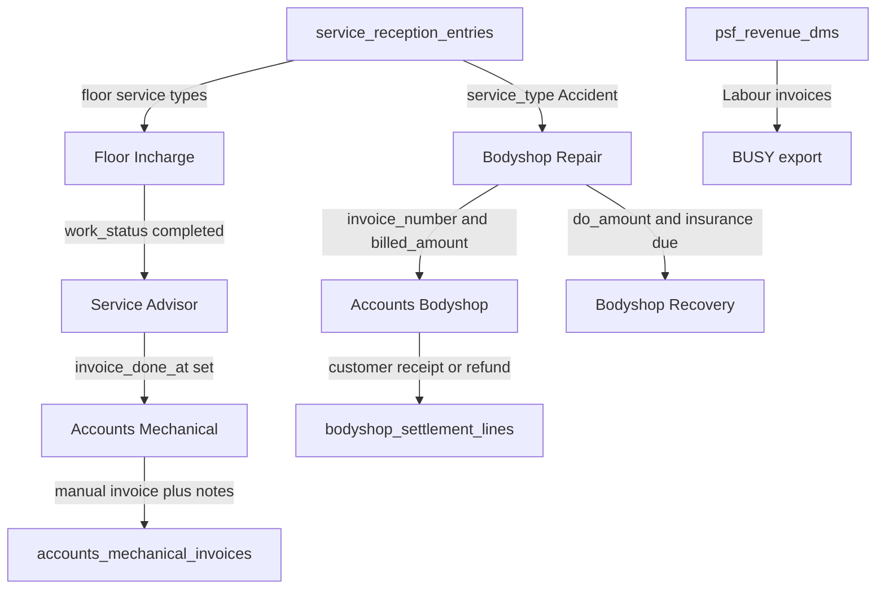

# ACCOUNTS-001: Mechanical and Bodyshop Accounts Desk

**Plan ID:** ACCOUNTS-001  
**Created:** 2026-09-11  
**Last Updated:** 2026-09-19
**Priority:** HIGH
**Owner:** Accounts + Platform Team  
**Status:** Active (web implemented; DBL-0055 Accounts DO post pending apply)  
**Platform:** webversion  
**Category:** accounts  
**Ledger:** DBL-0045/0046/0051/0052/0053/0054/0056/0057/0058/0059/0060/0061/0066 APPLIED. DBL-0068 APPLIED (Admin edit of posted Mechanical receipts). DBL-0069 APPLIED (SA invoice amount requires Floor completed). DBL-0073 PROPOSED (per-receipt remark on mechanical payment lines). DBL-0074 APPLIED (late RApp/JApp assign + JApp sequence reconcile + fail-closed Busy Export). DBL-0075 APPLIED (Mechanical Pending Remark reuses invoice `payment_notes`). DBL-0055 PROPOSED (Accounts may post insurer/DO lines). DBL-0080 PROPOSED (Bodyshop RApp/JApp on customer receipts; shared Mechanical sequences). Mechanical vouchers recalculated from `invoice_date >= 2026-09-02`. Do not reuse DBL-0043 (`busy`) or DBL-0044 (`busy_parts`). Do not re-run DBL-0059.  
**Route:** `/accounts`  
**Module:** `accounts`  
**Depends on:** BODYSHOP-SETTLEMENT-001 (`bodyshop_settlements`, Stage 18 lines); Service Advisor Mark Done (`invoice_done_at`)  
**Related (do not merge):** BODYSHOP-RECOVERY-001 (insurance-due follow-up book); BUSY-001 (`/busy` DMS Labour export)  
**Audit baseline:** HEAD `8c76f16` after rebase onto `fcbbd01`. Schema authority: `supabase/backups/full_metadata.sql`.

---

## Executive Summary

Add a top-level **Accounts** desk at `/accounts` with two sections. **Mechanical** lists Floor Incharge service types after Service Advisor **Mark Done**, then Accounts captures invoice number, billed amount, and payment notes. **Bodyshop** lists Repair Tracker cases that already have invoice number and billed amount so Stage 18 can post **both** insurer/DO receipts and customer-diff receipts on the existing `bodyshop_settlements` / `bodyshop_settlement_lines` ledger.

This is not `/busy` (BUSY Party/Invoice export). `/bodyshop-recovery` remains the insurance-due follow-up book. Accounts is an additional authorized posting surface for actual money receipts. Both write the same ledger; there is no second payment store.

**Risk Level:** MEDIUM  
**Estimated Duration:** 2–3 days  
**Rollback Strategy:** Revert DBL-0055 `can_post_do` / list columns and the `accounts_receipt` variant. Leave `bodyshop_settlements`, Recovery, and Mechanical payment lines untouched.

---

## Objectives

1. Register RBAC module `accounts` and route `/accounts` without colliding with `busy` or `invoices`.
2. Show Mechanical cases only after Mark Done on floor service types; let Accounts enter invoice number, billed amount, and payment notes.
3. Show Bodyshop cases when invoice number and billed amount exist; post Stage 18 insurer/DO and customer-diff receipts from this page onto the existing settlement ledger.
4. Keep Recovery insurance-due listing, Repair Tracker invoice/DO capture, SA Mark Done, and BUSY export unchanged.

---

## Context & Background

There is no `/accounts` page today. Mechanical completion is `service_reception_entries.invoice_done_at` (Mark Done). That flag has no invoice number or billed amount. Bodyshop money lives on `bodyshop_settlements` / `bodyshop_settlement_lines`. Recovery lists `insurance_due_amount > 0` only. After 2026-09-11 rebase, Recovery shows Customer / Policy / CP via a client-side join and `do_payment` can also post CP. That does not replace a customer-diff queue.

BODYSHOP-SETTLEMENT-001 Phase 7 Task 7.1 (dedicated `/accounts` queue) and BODYSHOP-RECOVERY-001 Task 3.1 (customer remaining book) are owned by this plan.

**Locked product decisions**

- v1 is a full desk, not view-only.
- Mechanical money is **manual Save**. Capture may **Fetch from DMS** into the form (invoice number, date, billed = `total_invoice_amount`) when exactly one live `psf_revenue_dms` row exists. Do not auto-write remaining or receipts. Do not auto-join `job_card_closed_data`.
- Do not change Mark Done, Floor Incharge, Repair Tracker invoice/DO capture, Recovery list filter, or BUSY.



---

## Locked rules (v1)

1. Nav label **Accounts**. Module `accounts`. Route `/accounts`. Top-level nav beside BUSY / Reports — not inside the Bodyshop dropdown, not a BUSY tab.
2. Grant by named user in Admin → Permissions (`accounts` view). View is enough to list, capture mechanical, and post customer. No Employee Master business role.
3. Org-wide visibility. No dealer/branch/fuel filter.
4. Mechanical row = `is_floor_incharge_service_type` + `invoice_done_at IS NOT NULL` + non-empty `jc_number` + `invoice_done_at >= 2026-09-11 00:00:00+05:30` (DBL-0053). Exclude Accident and Rusting. Pre-cutoff Mark Done cases stay in reception/Accounts invoice tables but are not listed.
5. Bodyshop row = non-blank `invoice_number` AND `invoice_amount` / `billed_amount` not null, settlement header exists, `overall_status <> cancelled`. Do **not** require `insurance_due_amount > 0`. Do **not** apply the Mechanical 11-Sep cutoff (DBL-0054).
6. Default Bodyshop filter = customer remaining pending (`due`/`refund` and status not `received`). Toggle All billed / Received. `kind = none` only under All billed.
7. Settlement panel: Accounts uses `variant="accounts_receipt"` — Section A DO/insurance lump-sum receipt (existing `postDoRelease` / MAIN path) + Section B customer-diff receipt. Do not reuse Recovery `do_payment` (Main/GST/TDS plus opportunistic CP). Do not upsert invoice/DO capture from Accounts.
8. Accounts users may post insurer/DO lines through `bodyshop_settlement_can_post_do` (DBL-0055). Recovery and Repair modify grants stay. Do not create a parallel permission helper.
9. Cancelled repairs are not Accounts Bodyshop rows.
10. Overall Payment Status is `derived_payment_status`. Do not show Received merely because the customer-diff side is received.

Floor Incharge types (authority: `src/lib/api/reception.ts` + `is_floor_incharge_service_type`): Running Repairs, First/Second/Third Free Service, Paid Service, Updation, E Breakdown, Campaign.

---

## Database changes (DBL-0045)

Do not reuse module `invoices` (id 2) or module `busy`. Do not re-run DBL-0026 / 0031–0037 / 0042 / 0043.

### A. `public.modules`

- `name = accounts`, `label = Accounts`, `route = /accounts`, `is_active = true`
- `sort_order` next to BUSY (BUSY is 29) — use 30 or the next free value at apply

### B. `public.accounts_mechanical_invoices` (1:1 reception entry)

- `reception_entry_id` unique FK to `service_reception_entries`
- denormalized `jc_number`
- `invoice_number` text, `invoice_date` date, `billed_amount` numeric(14,2)
- `payment_status` `pending` / `partial` / `received` / `not_received` default `pending`
- `amount_received` numeric(14,2) nullable
- `payment_notes` text
- `captured_by`, `captured_at`, `updated_at`
- RLS: authenticated direct writes denied; SELECT/write only via SECURITY DEFINER RPCs
- Do not add these money columns onto `service_reception_entries`

### C. RPCs

- `list_accounts_mechanical_cases()` — org-wide; floor types + `invoice_done_at`; left join invoice table
- `upsert_accounts_mechanical_invoice(...)` — requires `accounts` view/modify; validates Mark Done + floor type
- `list_accounts_bodyshop_cases()` — org-wide; invoice number + billed amount; return customer name, policy no, `customer_diff_amount`, `customer_remaining_amount`, `customer_posted_amount` (CP), kind, statuses. Do not rely on a second client join the way Recovery does today.
- `bodyshop_settlement_can_post_customer(repair_card_id)` — admin or `accounts` view/modify, org-wide
- `bodyshop_settlement_can_post_do(repair_card_id)` — admin, `accounts` view/modify, Recovery, or Repair modify (DBL-0055). `add_bodyshop_settlement_line` already uses this helper for MAIN/GST/TDS.

### D. Checks

Paired file under `supabase/sql_checks/`. After apply: refresh `full_metadata.sql`.

---

## Web UI

Pattern: `src/pages/BodyshopRecoveryPage.tsx` (KPIs, search, table, Excel, on-page post). Use Recovery labels: Customer, Policy, **Customer payment (CP)**.

**Wiring** (`src/App.tsx`, `src/components/TopNav.tsx`)

- Add `accounts` to `ModuleName`, `AppRoute`, `ROUTE_MODULE_MAP`, `NAV_ITEMS`
- Add `canAccessPath` prefix for `/accounts` next to `/busy`
- Update `docs/shared/reference/MODULE_ROUTE_CONTRACT.md` with an `accounts` row under `busy`

**Settlement panel** (`src/components/BodyshopSettlementPanel.tsx`)

- Extend variant to `'full' | 'do_payment' | 'customer_payment' | 'accounts_receipt'`
- `accounts_receipt`: hide Billing & DO capture; show Section A DO/insurance receipt + Section B customer-diff + complete settlement summary (invoice, DO, DO received/remaining, customer diff/received/remaining, outstanding, overall status)
- Recovery stays `do_payment`

**Page** `src/pages/AccountsPage.tsx` + `src/lib/api/accounts.ts`

- Tabs: Mechanical | Bodyshop
- Search: JC / reg / invoice
- Period chips: Mechanical **table** date authority follows status. All / Pending use Mark Done (`invoice_done_at`). Received uses actual receipt date (`payment_received_date`, else Asia/Kolkata `posted_at`) — a Received case appears when it has at least one non-Discount receipt in Period, even if Mark Done is outside Period. Mark Done count / billed / remaining stay on Mark Done. Invoice date remains Bodyshop. Cash / UPI / Credit Card **monetary** KPIs mean actual money received in the selected Period: `payment_received_date` (else Asia/Kolkata `posted_at`). Mark Done / `invoice_done_at` / `invoice_date` do not decide whether a receipt belongs to the Period. Status All / Pending / Received still scopes which cases contribute to those three cards, using the search-filtered Mechanical set (not the Mark Done-period table). Discount `reference` lines contribute ₹0 regardless of stored `payment_mode` and never qualify a Received table row. Clicking Cash/UPI/Card filters the table only — it does not zero the other mode tiles. Received + Cash/UPI/Card requires a matching non-Discount receipt **in Period**, not all-time mode history.
- Excel export per section. Mechanical export is receipt-line grain when payment lines exist (`voucher_no`, `account_name`, `Reference no`); Cash/UPI/Credit Card cards filter receipt lines, not header totals. Vouchers persist on `accounts_mechanical_payment_lines` (DBL-0057/0058). `account_name` prefers the exact BUSY Party Name for the invoice (`psf_revenue_dms` → `resolvePartyName`); unmatched invoices keep the Accounts owner/branch/VRN fallback.
- **Busy Export** downloads the same workbook headers for both desks: Invoice date, voucher_no, Account DR, Account CR, Amount DR, Amount CR, Reference no. Cash/UPI/card receipt lines only. Account DR: `CASH AT SITAPURA` / `PAYTM WALLET` / `CREDIT CARD A/C`. Account CR is `resolveBusyPaymentAccountCr` (VRN, then invoice, then unique JC). cheque/bank/other and NULL modes are skipped with a warning and do not block. Pending cases without receipts are omitted. Mechanical column **Invoice date** is `payment_received_date` → Accounts `invoice_date` → unique DMS labour `invoice_date`. Bodyshop uses `txn_date` → settlement `invoice_date` → unique DMS labour `invoice_date`, and **drops out-of-Period sibling lines**. Mechanical still exports sibling out-of-Period lines on a visible case (documented technical debt). Voucher eligibility is `>= 2026-09-02` (Accounts/settlement invoice date, else unique DMS labour). Eligible cash/UPI/card rows with blank persisted `voucher_no` **block** the download. The exporter never fabricates voucher numbers and never calls `nextval`.

**Mechanical desk**

- Columns: Mark Done at, JC, reg, model, service type, SA, branch, owner, invoice number, billed amount, **Received Amount** (sum of `accounts_mechanical_payment_lines` excluding `reference` Discount), remaining, **Pending Remark** (`accounts_mechanical_invoices.payment_notes`), payment status, notes
- Capture / Payments modal: invoice number, date, billed amount, and invoice file (reuse unused SA `invoice_storage_path` upload). **Fetch from DMS** fills those fields when the JC has exactly one live DMS invoice; Accounts still taps Save. 0 or 2+ DMS rows shows “No unique DMS invoice”. Remaining stays billed minus receipts. Invoice header locks after the first receipt.
- Receipts are posted as lines on `accounts_mechanical_payment_lines`: this amount + Payment mode (Cash/UPI/Card/Cheque/Bank/Other) + Payment received date + reference. `payment_received_date` is the business date (Asia/Kolkata); `posted_at` remains the original system insert timestamp. Platform Admin / Super Admin may edit a posted Mechanical receipt (`amount`, `payment_mode`, `reference`, `payment_received_date`) through `update_accounts_mechanical_payment` (`is_admin()` only). The client sends `accounts_mechanical_payment_lines.id`. Invoice id, previous values, and totals are read from persistence. `posted_by`, `posted_at`, `voucher_no`, `mechanical_invoice_id`, and `reception_entry_id` are not rewritten. `edited_by` / `edited_at` record the last trusted edit. Recalc reuses `accounts_mechanical_recalc`. Overpayment is stored as-is. Voucher series apply when the **effective invoice date** `>= 2026-09-02`: Accounts `invoice_date` when present, otherwise the unique live DMS labour `invoice_date` for the JC (DBL-0060; does not use `payment_received_date` / Mark Done). Cash gets `RApp/26-27/nnnn`; UPI+Card share `JApp/26-27/nnnn` at insert. If the line is still NULL and later becomes eligible (Accounts fills a still-NULL invoice date, or unique DMS labour arrives), `accounts_mechanical_assign_eligible_null_vouchers` assigns the next number (DBL-0074). Non-null vouchers are never rewritten — they have already been posted into BUSY. cheque/bank/other stay null. Editing a posted line never regenerates, deletes, or replaces `voucher_no`. If mode/date/amount/reference no longer match an already-exported voucher, the number is kept and BUSY must be re-exported; the UI warns. History shows Received Date plus an Admin-only Action/Edit column. Payment status is automatic from billed vs sum(receipts). Mechanical Gatepass is eligible when remaining ≤ 0, remaining ≤ 2% of billed, or a **valid** persisted Keep on Credit exists (`keep_on_credit` + non-blank `keep_on_credit_reason` + `keep_on_credit_approved_by` + `keep_on_credit_approved_at`). Financial remaining and `payment_status` are not rewritten for the 2% rule or Keep on Credit. Receipts may exceed remaining; the posted line keeps the entered amount. Create Gatepass goes through `issue_accounts_mechanical_gatepass`. Bodyshop settlement receipts are unchanged.
- KPI: Mark Done count, invoice-pending count, billed sum, customer remaining / received still follow Mark Done Period. Cash / UPI / Credit Card money is actual receipt-line grain dated by `payment_received_date` (IST `posted_at` fallback), after status + Search, excluding Discount `reference`. Mark Done date does not restrict those three cards.

**Bodyshop desk**

- Columns: JC, reg, customer, branch, SA, invoice number, invoice date, billed amount, DO amount / remaining, customer diff, remaining, received, outstanding, overall payment status
- Post Payment opens `variant="accounts_receipt"`
- KPI: billed vehicles, outstanding sum, overall pending / partial / received split. Cash / UPI / Credit Card money is customer-receipt grain on `bodyshop_settlement_lines` (`party=customer`, `line_type=receipt`, `component=CUSTOMER`, not reversed) dated by `txn_date`. Stored modes `cash` / `upi` / `card` via `normalizeAccountsPaymentMode`. NULL historical modes, insurance/DO lines, refunds, and reversals contribute ₹0. Independent of overall Partial/Received. Cards are clickable filters (toggle-off to All) and compose with Search + invoice_date Period + remaining/received/pending. A case matches every cash/upi/card it contains. Eligible customer receipts persist `voucher_no` from the existing Mechanical RApp/JApp sequences (DBL-0080). Mechanical payment-mode helpers stay Mechanical-only.

---

## Implementation Tasks

### Phase 1: Docs
- [x] **Task 1.1:** Write this plan under `categories/accounts/active/`.
- [x] **Task 1.2:** Register in web INDEX + IMPLEMENTATION_TRACKER; DBL-0045 PROPOSED.
- [x] **Task 1.3:** Point SETTLEMENT Task 7.1 and RECOVERY Task 3.1 here.

### Phase 2: Database
- [x] **Task 2.1:** Migration: module, `accounts_mechanical_invoices`, list/upsert RPCs, customer-post grant.
- [x] **Task 2.2:** Paired sql_checks.
- [x] **Task 2.3:** Operator apply DBL-0045 (sql_checks passed 2026-09-11). Refresh `full_metadata.sql` still pending.

### Phase 3: Web
- [x] **Task 3.1:** Route, nav, RBAC, `canAccessPath`.
- [x] **Task 3.2:** `customer_payment` variant on settlement panel.
- [x] **Task 3.3:** Accounts page — Mechanical capture desk.
- [x] **Task 3.4:** Accounts page — Bodyshop customer-diff desk + Excel.
- [x] **Task 3.5:** Mechanical Capture **Fetch from DMS** (form fill only; DBL-0048). No remaining write. No bulk list fill.
- [x] **Task 3.10:** Mechanical Gatepass 2% short-payment, Keep on Credit, exact overpayment, trusted issue RPC (DBL-0061). Dedicated reason + validity + revocation metadata (DBL-0066).
- [x] **Task 3.11:** Mechanical Cash / UPI / Credit Card KPIs use status filter + `payment_received_date` (IST `posted_at` fallback). Exclude Discount `reference`. Receipt Period is independent of Mark Done table period.
- [x] **Task 3.12:** Admin-only edit of posted Mechanical receipts (DBL-0068). Trusted `update_accounts_mechanical_payment`. Non-admin RPC denied. Voucher number preserved. Recalc + Gatepass refresh. Bodyshop unchanged.
- [ ] **Task 3.13:** Per-receipt Remark on Mechanical payment entries (DBL-0073). Layout Amount / Mode / Date then Reference no. / Remark. Persist on `accounts_mechanical_payment_lines.remark`.
- [x] **Task 3.15:** Mechanical table Pending Remark between Remaining and Status (DBL-0075). Persist on existing `accounts_mechanical_invoices.payment_notes`. Inline save. Do not clear on received. Do not change money or vouchers.
- [x] **Task 3.16:** Mechanical table date authority by status: All/Pending = Mark Done; Received = receipt date. Received + Cash/UPI/Card uses Period-scoped receipts. Case-level dedupe. Do not change Received Amount, payment-mode KPIs, or Bodyshop.
- [x] **Task 3.17:** Bodyshop Cash / UPI / Credit Card KPIs from `bodyshop_settlement_lines` customer receipts (`txn_date`, stored `payment_mode`). No status/recalc change. Mechanical helpers unchanged.
- [x] **Task 3.18:** Bodyshop payment-mode card filters + shared RApp/JApp + BUSY export (DBL-0080). Mechanical voucher numbers unchanged. Do not re-run DBL-0059.

### Phase 4: Closeout
- [x] **Task 4.1:** MODULE_ROUTE_CONTRACT (grant Accounts users after SQL apply).
- [x] **Task 4.2:** Evidence test matrix.
- [ ] **Task 4.3:** `npm run docs:validate`; Accounts + Eng sign-off after SQL apply.

---

## Activity Tracker

> Update this section in real-time as work progresses.

### Legend
- COMPLETED
- IN PROGRESS
- PENDING
- BLOCKED

### Phase 1
```
✅ 1.1 | Plan file | Eng | 2026-09-11 | 2026-09-11 | ACCOUNTS-001
✅ 1.2 | Index + tracker + DBL-0045 | Eng | 2026-09-11 | 2026-09-11 | After DBL-0043 busy
✅ 1.3 | Related-plan pointers | Eng | 2026-09-11 | 2026-09-11 | Settlement 7.1 / Recovery 3.1
```

### Phase 2
```
✅ 2.1 | Migration | Eng | 2026-09-11 | 2026-09-11 | 20260911130000
✅ 2.2 | sql_checks | Eng | 2026-09-11 | 2026-09-11 |
✅ 2.3 | Apply + sql_checks | Operator | 2026-09-11 | 2026-09-11 | All 7 checks true; metadata refresh pending
```

### Phase 3
```
✅ 3.1 | Route/nav/RBAC | Eng | 2026-09-11 | 2026-09-11 | Beside BUSY
✅ 3.2 | customer_payment variant | Eng | 2026-09-11 | 2026-09-11 | Superseded by accounts_receipt
✅ 3.3 | Mechanical desk | Eng | 2026-09-11 | 2026-09-11 | Manual invoice capture
✅ 3.4 | Bodyshop desk | Eng | 2026-09-11 | 2026-09-11 | Customer remaining book
✅ 3.6 | Unified Bodyshop receipts | Eng | 2026-09-12 | 2026-09-12 | DBL-0055 + accounts_receipt
✅ 3.7 | Mechanical voucher Excel | Eng | 2026-09-14 | 2026-09-14 | DBL-0057 APPLIED; receipt-grain export
✅ 3.8 | Voucher eligibility invoice_date | Eng | 2026-09-14 | 2026-09-14 | DBL-0058 APPLIED; cutoff 2026-09-02
✅ 3.9 | Recalculate vouchers from 2-Sep | Eng | 2026-09-14 | 2026-09-14 | DBL-0059 APPLIED; RApp 22 / JApp 78
✅ 3.10 | Mechanical Gatepass 2% / credit / overpay | Eng | 2026-09-15 | 2026-09-15 | DBL-0061 APPLIED
✅ 3.11 | Mechanical payment-mode KPI receipt-date + Discount exclusion | Eng | 2026-09-15 | 2026-09-15 | Client helper; no schema
✅ 3.12 | Admin edit posted Mechanical receipts | Eng | 2026-09-16 | 2026-09-16 | DBL-0068 APPLIED; is_admin() RPC
⏳ 3.13 | Per-receipt remark | Eng | 2026-09-16 | - | DBL-0073 PROPOSED
✅ 3.14 | Late voucher assign + fail-closed Busy Export | Eng | 2026-09-16 | 2026-09-16 | DBL-0074 APPLIED; line 222 JApp/26-27/0195; 221 stays 0140
✅ 3.15 | Mechanical Pending Remark | Eng | 2026-09-17 | 2026-09-17 | DBL-0075 APPLIED; reuses invoice payment_notes; practical leftover_fail=0
✅ 3.16 | Mechanical table date authority by status | Eng | 2026-09-17 | 2026-09-17 | Received = receipt date; All/Pending = Mark Done; no schema
✅ 3.17 | Bodyshop payment-mode KPIs | Eng | 2026-09-19 | 2026-09-19 | Customer receipts + txn_date; no schema; Mechanical unchanged
✅ 3.18 | Bodyshop card filter + RApp/JApp + BUSY export | Eng | 2026-09-19 | 2026-09-19 | DBL-0080 PROPOSED; shared Mechanical sequences; Period on txn_date lines
⏳ 3.5 | Capture Fetch from DMS | Eng | 2026-09-11 | 2026-09-11 | DBL-0048 applied; web button pending deploy
```

### Phase 4
```
✅ 4.1 | Contract | Eng | 2026-09-11 | 2026-09-11 | Grant users after apply
✅ 4.2 | Test matrix | Eng | 2026-09-11 | 2026-09-11 | evidence/
⏳ 4.3 | Validate + sign-off | Eng + Accounts | - | - | After SQL apply
```

---

## Dependencies & Prerequisites

- [x] BODYSHOP-SETTLEMENT-001 ledger tables and `postCustomerAmount` exist.
- [x] Service Advisor Mark Done writes `invoice_done_at`.
- [x] Post-rebase frontend audit (BUSY + Recovery CP) recorded 2026-09-11.
- [x] DBL-0045 applied (sql_checks passed 2026-09-11).
- [ ] Named Accounts users granted `accounts` view.

---

## Risk Assessment

| Risk | Probability | Impact | Mitigation |
|------|------------|--------|-----------|
| Colliding with BUSY or DBL-0043 | Medium | High | Separate module/route; ledger DBL-0045 only |
| Reusing Recovery `do_payment` mixes Main/GST/TDS + opportunistic CP | Medium | High | Dedicated `accounts_receipt` variant |
| Recovery CP column mistaken for the customer book | Medium | Medium | Recovery list stays insurance-due; Accounts posts both sides on the same ledger |
| Mechanical money written onto reception | Low | High | Dedicated `accounts_mechanical_invoices`; SA flag stays `invoice_done_at` |
| Accounts user cannot post customer or DO lines | High if helper omitted | High | `can_post_customer` (DBL-0045) + `can_post_do` includes accounts (DBL-0055) |

---

## Success Criteria

- Mark Done mechanical JC appears in Accounts → Mechanical without a Floor/SA code change.
- Accident cases never appear in Mechanical.
- Accounts can save invoice number / billed amount / notes on a Mark Done row.
- Bodyshop row appears after invoice number + billed amount exist, including insurance due ₹0.
- Customer receipt/refund from Accounts updates `bodyshop_settlements` / card cache.
- DO / insurance receipt from Accounts uses `add_bodyshop_settlement_line` MAIN path; Recovery outstanding follows the same header.
- Recovery still lists only insurance due; Recovery CP column still works.
- `/busy` still exports; user with only `busy` cannot open `/accounts`.
- User without `accounts` sees AccessDenied at `/accounts`.

---

## Out of v1

- Mobile
- Bulk “Fill unmatched from DMS” on the Mechanical list (Capture Fetch is in v1.1)
- Auto-write Remaining / mark DMS CASH as received
- Changing BUSY eligibility or `/busy` UI
- Bank UTR matching
- Changing SA Mark Done or Floor Incharge
- Moving invoice/DO capture off Repair Tracker
- Replacing `/bodyshop-recovery` or removing its CP/CA columns
- Multi-invoice per JC
- Rusting / PDI / other non-floor types

---

## Communication & Sign-Off

**Stakeholders:**
- [ ] Accounts Lead: _______________ (Date)
- [ ] Platform / Engineering: _______________ (Date)
- [ ] Bodyshop Ops: _______________ (Date)

---

## Notes & Lessons Learned

### 2026-09-19 - Bodyshop payment-mode cards, shared vouchers, BUSY export

- Cash / UPI / Credit Card tiles are clickable filters (`bsPaymentModeFilter`). Toggle-off returns All. Period change does not reset the selected mode. Section switch resets both desks' mode filters.
- Mode matching uses qualifying customer receipts (`party=customer`, `line_type=receipt`, `component=CUSTOMER`, not reversed) with `txn_date` in Period. Split receipts match every stored cash/upi/card they contain. NULL mode is never inferred.
- Status cards stay on invoice_date Period + remaining/received/pending/all. Mode filter composes after that. Outstanding / `derived_payment_status` / zero-DO are unchanged.
- `voucher_no` on `bodyshop_settlement_lines` is assigned at customer-receipt insert via `accounts_mechanical_next_voucher_no` (existing RApp/JApp 26-27 sequences). Eligibility: settlement `invoice_date`, else unique DMS labour date, `>= 2026-09-02`. NULL-only late assign. The append-only trigger still blocks DELETE and general UPDATE; it allows only `voucher_no` NULL→value with every other column unchanged. Immutable once set. Do not re-run DBL-0059.
- Bodyshop Busy Export reuses `buildBusyPaymentExportRows`. One row per in-Period cash/upi/card customer receipt. Account CR is `resolveBusyPaymentAccountCr`. Missing eligible `voucher_no` blocks the workbook. Mechanical sibling-line Period leak is unchanged technical debt.
- Ledger: DBL-0080.

### 2026-09-19 - Bodyshop Cash/UPI/Credit Card KPIs

- Tiles are customer-receipt money in the selected Period. Date is `bodyshop_settlement_lines.txn_date`. Not invoice_date / created_at / Mechanical `payment_received_date`.
- Predicate: `party=customer` AND `line_type=receipt` AND `component=CUSTOMER` AND `is_reversed=false`. Same customer-posted ledger as Customer Received. Insurance Main/GST/TDS, refunds, waivers, and reversed rows are excluded.
- Stored modes reuse `normalizeAccountsPaymentMode`: `cash` / `upi` / `card`. Credit Card display label is not a stored value. NULL historical `payment_mode` is not inferred and contributes ₹0 to all three tiles.
- Search-filtered Bodyshop cases scope contributing cards. Remaining / Pending / Received status filters do not. Overall Partial/Received and `recalc_bodyshop_settlement` are unchanged.
- Helper: `sumAccountsBodyshopPaymentModeKpis` in `src/lib/api/accounts.ts`. Lines: `listAccountsBodyshopPaymentLines`. Checks: `scripts/verify_accounts_split_payment_drafts.mjs`.

### 2026-09-15 - Mechanical table Received Amount

- Column sits after Billed and before Remaining.
- Sum of `accounts_mechanical_payment_lines` for the case. Exclude when `reference` is Discount (`DISCOUNT` stored; match trim + case-insensitive). Genuine `other` stays in. Not billed − remaining and not header `amount_received`.
- Independent of Cash/UPI/Credit Card table filters.

### 2026-09-15 - Mechanical Cash/UPI/Credit Card KPI scope

- Case list / count / billed / remaining period stays Mark Done (`invoice_done_at`, Asia/Kolkata).
- Cash / UPI / Credit Card tiles mean actual money received in the selected Period. Receipt date is `payment_received_date`, else Asia/Kolkata calendar date of `posted_at`. Not `invoice_done_at` / Mark Done / `invoice_date`.
- Status `all` / `pending` / `received` still scopes contributing cases (`partial` is neither Received nor Pending). Status uses the search-filtered Mechanical set, not the Mark Done-period table. Search still applies.
- Discount `reference` (trim + case-insensitive `discount`, live `DISCOUNT`) contributes ₹0 to all three cards regardless of stored `payment_mode`. Same detector as table Received Amount (`isMechanicalDiscountPaymentLine`). Genuine `other` is not reclassified onto the cards.
- Mode tiles are not inputs to the other mode totals (clicking Cash does not clear UPI/Card).
- Helper: `sumAccountsMechanicalPaymentModeKpis` in `src/lib/api/accounts.ts`. Checks: `scripts/verify_accounts_split_payment_drafts.mjs`.

### 2026-09-17 - Mechanical table date authority by status

- All / Pending table period stays Mark Done (`invoice_done_at`, Asia/Kolkata).
- Received table period is receipt date (`payment_received_date`, else Asia/Kolkata `posted_at`). Mark Done may be outside Period.
- A Received row is a listed Mechanical case with `payment_status = received` and at least one qualifying receipt in Period. Discount `reference` never qualifies. Multiple matching lines still show one case.
- Received + Cash/UPI/Card requires that mode on a qualifying in-Period receipt. All/Pending + mode still uses all-time `filterMechanicalCasesByPaymentMode`.
- Search still runs first on the desk list. Table Received Amount is unchanged (all-time actual received, excluding Discount).
- Cash/UPI/Credit Card KPI helpers are unchanged (Task 3.11).
- Helper: `filterMechanicalAccountsTableCases` in `src/lib/api/accounts.ts`.

### 2026-09-17 - Mechanical Pending Remark

- Table column sits between Remaining and Status. Compact inline input + explicit Save. Not a keystroke write.
- Persists on existing `accounts_mechanical_invoices.payment_notes`. No new table. Not Keep on Credit reason. Not per-receipt `remark`.
- Editable while remaining is outstanding and an invoice header exists. Fully received/settled rows are read-only (`—` when empty). Stored value is not cleared when the case later becomes received.
- Trusted RPC `set_accounts_mechanical_pending_remark`. Invoice capture omitting `p_payment_notes` preserves the saved remark. Recalc, receipts, vouchers, billed, remaining, payment-mode KPIs, and Bodyshop are unchanged.
- Ledger: DBL-0075.

### 2026-09-16 - Admin edit of posted Mechanical receipts

- Platform Admin / Super Admin may edit a posted Mechanical receipt in the Accounts modal Receipts table (`isAdmin` in UI; `is_admin()` on the server).
- Trusted RPC `update_accounts_mechanical_payment(payment_line_id, amount, payment_mode, reference, payment_received_date)`. Client must not UPDATE `accounts_mechanical_payment_lines` directly.
- Updatable: amount (> 0, overpayment allowed), payment_mode (existing Accounts modes), reference (optional), payment_received_date (required).
- Protected: id, mechanical_invoice_id, reception_entry_id, posted_by, posted_at, voucher_no.
- Recalc reuses `accounts_mechanical_recalc`. Gatepass eligibility follows refreshed remaining / Keep on Credit.
- `voucher_no` is never regenerated on edit. If mode no longer matches RApp/JApp, the number is kept; BUSY export uses the new mode for Account DR and the preserved voucher. Re-export if already sent.
- Audit: `edited_by` / `edited_at` on the payment line. Original posting identity stays on `posted_by` / `posted_at`.
- Bodyshop settlement receipts are unchanged.
- Ledger: DBL-0068.

### 2026-09-15 - Mechanical Gatepass 2% / Keep on Credit / overpay

- Gatepass eligibility is remaining ≤ 0, remaining ≤ round(billed × 0.02, 2), or **valid** persisted Keep on Credit.
- Valid Keep on Credit = `keep_on_credit` true AND non-blank `keep_on_credit_reason` AND `keep_on_credit_approved_by` AND `keep_on_credit_approved_at`. A checkbox click or `keep_on_credit=true` alone does not release Gatepass.
- 2% and Keep on Credit do not insert payment lines or change `payment_status` / remaining.
- Keep on Credit is Admin module `accounts_keep_on_credit` (View or Modify grant), plus platform `is_admin()` and linked active GM. Not `accounts.can_modify`.
- Trusted setter `set_accounts_mechanical_keep_on_credit(id, flag, reason)` stores authenticated actor + server timestamp. Revoke keeps original reason/approver and records `keep_on_credit_revoked_by` / `keep_on_credit_revoked_at` on the same header (no event-history table).
- Issue RPC `issue_accounts_mechanical_gatepass` computes eligibility from persisted columns. Payload `payment_status` is the clearance label (`Paid` / `Short payment allowed` / `Released on credit`), not financial `payment_status`.
- Overpayment posts the entered amount. Remaining display still floors at 0; BUSY export uses the line amount. 2% shortage and Keep on Credit do not create BUSY payment/discount lines.
- Ledger: DBL-0061, DBL-0066.

### 2026-09-14 - Voucher eligibility is invoice_date

- BUSY accounting started 2-Sep-2026. Accounts RApp/JApp follow `accounts_mechanical_invoices.invoice_date >= 2026-09-02`.
- Do not use payment received date, posted_at, or Mark Done date as the voucher cutoff.
- Existing persisted voucher numbers stay. Newly eligible NULL cash/upi/card lines take the next sequence (historical numbering vs earliest 2-Sep receipt is expected if DBL-0057 already issued 11-Sep numbers).
- Ledger: DBL-0058. Superseded by DBL-0059 full recalculation.

### 2026-09-12 - Mechanical payment received date

- Mechanical Post payment captures `payment_received_date` on the existing payment-line table. Defaults to today IST. Distinct from `posted_at`. Ledger: DBL-0056.

### 2026-09-12 - Unified Bodyshop receipts

- Approved: Accounts posts both insurer/DO and customer-diff receipts on `bodyshop_settlement_lines`.
- Former v1 lock “Accounts must not post Main/GST/TDS” is superseded by DBL-0055.
- Recovery remains the insurance-due book. No second ledger.

### 2026-09-11 - Kickoff / post-rebase audit

- HEAD `8c76f16`. Dump has no `accounts` or `busy` module row; BUSY is frontend + DBL-0043 PROPOSED.
- Recovery CP/policy are client-side joins after `list_bodyshop_do_recovery()`.
- `do_payment` now posts CP via `postCustomerAmount` when CP is entered.
- Mechanical Mark Done still has no invoice number/amount on reception.

---

## Related Documentation

- `docs/Implementation_plans/webversion/categories/bodyshop/active/BODYSHOP-SETTLEMENT-001_PAYMENT_RECONCILIATION_LEDGER_PLAN_2026-09-04.md`
- `docs/Implementation_plans/webversion/categories/bodyshop/active/BODYSHOP-RECOVERY-001_DO_INSURANCE_RECOVERY_BOOK_PLAN_2026-09-04.md`
- `docs/Implementation_plans/webversion/categories/operations/active/BUSY-001_BUSY_ACCOUNTING_EXPORT_PLAN_2026-09-10.md`
- `docs/shared/reference/MODULE_ROUTE_CONTRACT.md`
- `docs/shared/reference/DB_CHANGE_LEDGER.md` (DBL-0045, DBL-0055, DBL-0057, DBL-0058, DBL-0060, DBL-0061, DBL-0066, DBL-0068, DBL-0069, DBL-0073)
- Evidence (later): `docs/Implementation_plans/webversion/categories/accounts/evidence/ACCOUNTS-001_TEST_MATRIX.md`

---

**Last Updated:** 2026-09-16  
**Status:** IN PROGRESS (Mechanical Admin receipt edit shipped as DBL-0068; Gatepass 2%/Keep on Credit/overpay as DBL-0061+0066; DBL-0055 SQL apply pending)
