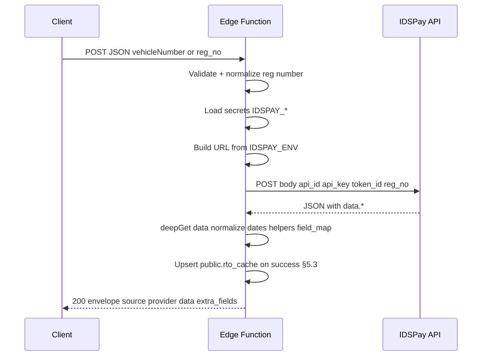

# SUPABASE-004: IDSPay RC Advance Verification Edge Function (Techwheels Parity)

**Plan ID:** SUPABASE-004  
**Created:** 2026-07-22  
**Priority:** HIGH  
**Owner:** Platform Team (Supabase Edge)  
**Status:** Active — **Phase 3 verified 2026-07-22**; **Phase 5 planned** (`rto_idspay` → `all_service_data` insurance sync); Phase 4 optional (AutoDoc)  
**Parent context:** Complements existing AutoDoc RC path documented in `docs/Implementation_plans/completed/webversion/categories/autodoc/active/RC_LOOKUP_EDGE_FUNCTION_IMPLEMENTATION_PLAN.md` (`invoke-ocean025` + Invincible Ocean + `public.rto_cache`). This plan adds a **separate IDSPay provider contract** aligned with TECHWHEELS-WEB `invoke-rc-provider` v3 — not a modification of `invoke-ocean025` unless explicitly decided in §4.

**Reference implementation (external, read-only port source):**

1. `TECHWHEELS-WEB/supabase/functions/invoke-rc-provider/index.ts` (v3)
2. `TECHWHEELS-WEB/src/pages/admin/ManageApiProviders.jsx` — `IDSPAY_PREFILL` sample shapes

**Governance:** SUPABASE-001 rules R3–R9 (`supabase/migrations/` for schema; `supabase/backups/full_metadata.sql` for schema authority in **this** repo).

**Schema authority snapshot (2026-07-22):** `supabase/evidence/authoritative_metadata_manifest.json` — sha256 `9fd90934d6c2541d47da3c77b412789012f95086267ea86df51a0e86cf75e68a` (includes deployed `public.rto_idspay`).

**Vendor documentation (audited 2026-07-22):** IDSPay `ServiceDocumentation.pdf` — RC Advance Verification v1.0; audit report at `docs/Implementation_plans/webversion/categories/supabase/evidence/SUPABASE-004_IDSPAY_SERVICE_DOCUMENTATION_AUDIT_2026-07-22.md`.

---

## Executive Summary

Deliver a production-ready Supabase Edge Function that calls **IDSPay RC Advance Verification** using the same upstream contract as Techwheels: **POST** JSON to `{prod|uat base}/srv2/validation/rc` with credentials **`api_id`, `api_key`, `token_id`, `reg_no` in the request body** (not headers), parse provider payload at dot path **`data`**, and return a stable normalized JSON envelope (`source`, `provider`, `vehicle_no_field_used`, `data_path_used`, `data`, `extra_fields`).

On **successful** IDSPay RC validation, **upsert `public.rto_idspay`** with exact IDSPay `data.*` column names and full upstream JSON in `provider_response`. **Phase 5** (planned): on INSERT/UPDATE of `rto_idspay`, sync selected insurance fields into **`public.all_service_data`** (see §Phase 5).

**Risk Level:** 🟡 MEDIUM (third-party API, credential handling, response normalization, dual response shapes)  
**Estimated Duration:** 1–2 days (function + secrets + deploy verify); +0.5 day for `rto_cache` mapping parity with `invoke-ocean025`  
**Rollback Strategy:** Undeploy function or revert to prior deployment; drop optional migrations if applied.

---

## Authority Inputs (This Repo — Verified 2026-07-22)

| Fact | Source |
|------|--------|
| Edge stack pattern | Deno + `https://esm.sh/@supabase/supabase-js@2` (see `supabase/functions/invoke-ocean025/index.ts`) |
| Shared CORS | `supabase/functions/_shared/cors.ts` |
| Optional JWT + role gate | `supabase/functions/_shared/auth.ts` (`validateRequest`) — **not** used by `invoke-ocean025` today |
| `public.rto_cache` exists | `supabase/migrations/20260526140500_create_rto_cache_for_rc_lookup.sql`, metadata in `supabase/backups/full_metadata.sql` |
| **`public.api_provider_config` does not exist** in this project metadata | Grep of `supabase/backups/full_metadata.sql` — no matches |
| **`public.rc_lookup_log` does not exist** in this project metadata | Same |
| Current AutoDoc RC client | `src/lib/api/rcLookup.ts` → default function `invoke-ocean025`, body `{ vehicleNumber, consent: 'Y' }`, expects `rto_cache`-shaped fields |

Do **not** invent columns or policies for tables that are not in the authoritative metadata unless shipped as a new migration in Phase 2 (optional).

---

## 1. Provider Contract (Authoritative — From Product Spec)

### 1.1 Identity

| Property | Value |
|----------|--------|
| Display name | IDSPay RC Advance Verification |
| Service name (IDSPay) | RC Advance Verification |
| API version (PDF) | v1.0 |
| Current environment (dashboard) | **PRODUCTION** — default `IDSPAY_ENV=prod` unless testing |
| Provider slug (response metadata) | **`idspay`** or **`idspay_v2`** — pick **one** before implementation (§4.1) |
| Docs | https://www.idspay.in |
| Production base URL | `https://javabackend.idspay.in/api/v1/prod` |
| UAT base URL | `https://javabackend.idspay.in/api/v1/uat` |
| RC path (append to base) | `/srv2/validation/rc` |
| Full production endpoint | `https://javabackend.idspay.in/api/v1/prod/srv2/validation/rc` |
| HTTP method | `POST` |
| Content-Type | `application/json` |

### 1.2 Authentication (body fields — mandatory)

Every upstream request JSON must include (IDSPay request body table + PDF):

| Field | Requirement | Source / notes |
|-------|-------------|----------------|
| `api_id` | Mandatory | **Login ID** = API ID (pattern e.g. `APID03XXXX`; dashboard example `APID2175`) |
| `api_key` | Mandatory | **IP Whitelist** menu in IDSPay portal (pattern may be UUID or include `&` per examples) |
| `token_id` | Mandatory | Issued **after IP is whitelisted**; **Token ID is different for each whitelisted IP** |
| `reg_no` | Mandatory | Vehicle registration number (normalize before send — §1.3) |

**Account prerequisites (operator + PDF integration section):**

1. API account **activated** before calling the service.  
2. Valid API key issued by IDSPay.  
3. Caller source IP **whitelisted**; use the `token_id` that matches that IP.  
4. All requests over **HTTPS** only; `Content-Type: application/json`.  
5. Same `api_id` / `api_key` / `token_id` for prod and UAT — **change base URL only** (§2.2).  
6. PDF recommends **UAT testing** before production traffic.

**Constraints:** Do not move credentials to headers. Do not rename credential keys. Do not change base URLs or path.

### 1.3 Edge function incoming request

Accept at least one of (mirror reference validation where possible):

| Incoming field | Upstream |
|----------------|----------|
| `vehicleNumber` | Map to `reg_no` after normalization |
| `reg_no` | Pass through as `reg_no` |

Reference behavior may require `vehicleNumber` at the gateway validation layer — confirm against TECHWHEELS-WEB v3 during Phase 0 and document the chosen rule in evidence.

**Registration normalization:** Reuse the same algorithm as existing RC code: trim, uppercase, strip non `[A-Z0-9]` (see `normalizeRegNumber` in `invoke-ocean025/index.ts`).

### 1.4 Upstream request example (structure only)

IDSPay dashboard **Test API → RC Advance Verification** documents this exact body (placeholders shown in UI):

```json
{
  "api_id": "XXXXXXX",
  "api_key": "XXXXXXXXX-XXX-XXXX-XXX-XXXXXXXX",
  "token_id": "XXXXXXXXXXXXXXXXX",
  "reg_no": "XXXXXXXX"
}
```

Production values use the same key names; only `reg_no` changes per lookup.

### 1.4.1 IDSPay dashboard confirmation (2026-07-22)

| UI / ops fact | Value |
|---------------|--------|
| Service | RC Advance Verification |
| Dashboard path | IDSPay → Test API → RC Advance Verification |
| Method | `POST` |
| Path (append to env base) | `/srv2/validation/rc` |
| Content-Type | `application/json` |
| **API ID** (`api_id`) | `APID2175` (visible in dashboard Test API form) |
| **API Key** (`api_key`) | UUID-shaped secret — set only in **Supabase Edge secrets** (`IDSPAY_API_KEY`); operator handoff 2026-07-22 |
| **Token ID** (`token_id`) | Opaque string — set only in **Supabase Edge secrets** (`IDSPAY_TOKEN_ID`); operator handoff 2026-07-22 |
| Prod vs UAT credentials | **Same** `api_id`, `api_key`, and `token_id` for both environments; **change base URL only** (`IDSPAY_ENV` → §2.2) — per dashboard + PDF |
| Credential sourcing | API ID = login ID; API Key + Token ID from **IP Whitelist** menu (see §1.10) |
| Account status | Must be **activated** before utilization |
| Wallet / billing | RC calls debit Business Wallet (dashboard shows balance); monitor for insufficient funds errors |

**Security (plan authority):** Real `api_key` and `token_id` must **never** be committed to this repo or pasted into evidence files. If credentials were shared outside Supabase Dashboard, **rotate in IDSPay** and update Edge secrets.

### 1.5 Response parsing

| Rule | Value |
|------|--------|
| Provider payload root | `deepGet(responseJson, "data")` — i.e. object at **`data`** |
| `vehicle_no_field_used` | `reg_no` |
| `data_path_used` | `data` |
| Normalization | Map IDSPay nested vehicle fields into stable internal keys listed in §3.2 |
| Dates | Parse multiple formats including `DD-Mon-YYYY` and `DD/MM/YYYY` (port helpers from reference v3) |
| Optional quality helpers | Fuel type, colour cleanup, make extraction — match reference quality if present in v3 |
| `field_map` | Optional JSON `{ our_key: provider_key }`; may be empty for IDSPay if keys already align |

### 1.6 Successful response envelope (target)

```json
{
  "source": "live",
  "provider": "[idspay|idspay_v2 per §4.1]",
  "vehicle_no_field_used": "reg_no",
  "data_path_used": "data",
  "data": {
    "reg_no": "",
    "make": "",
    "model": "",
    "variant": "",
    "colour": "",
    "fuel_type": "",
    "owner_name": "",
    "owner_father_name": "",
    "num_owners": "",
    "reg_date": "",
    "mfg_year": "",
    "insurance_expiry": "",
    "insurance_company": "",
    "insurance_policy_no": "",
    "rc_expiry": "",
    "chassis": "",
    "engine": "",
    "financed": "",
    "rc_financer": "",
    "blacklisted": "",
    "blacklist_details": "",
    "status": "",
    "seat_capacity": "",
    "vehicle_class": "",
    "reg_authority": "",
    "body_type": "",
    "cubic_capacity": "",
    "gross_weight": "",
    "wheelbase": "",
    "pucc_no": "",
    "pucc_upto": "",
    "permit_type": "",
    "permit_valid_upto": "",
    "norms_type": "",
    "is_commercial": "",
    "present_address": "",
    "permanent_address": "",
    "mobile_no": "",
    "is_partial": ""
  },
  "extra_fields": {}
}
```

Non-success: structured JSON error with `"provider": "[same slug as §4.1]"`, HTTP status appropriate to failure class (validation 400, config 500, upstream 502/503 as per reference).

### 1.7 Raw upstream response — success (IDSPay RC Advance Verification)

Authoritative sample from product owner / dashboard documentation. Top-level **`status`** object is **sibling** to **`data`** (not inside `data`). Normalization still uses **`data`** as `data_path_used` for vehicle fields; preserve full payload in `api_rc_response` when persisting cache.

```json
{
  "status": {
    "code": 200,
    "type": "success",
    "message": "RC validation successful."
  },
  "message": "RC validation successful.",
  "data": {
    "reg_no": "Reg123",
    "class": "23Class767",
    "chassis": "76Chesisi34",
    "engine": "76Engine767",
    "vehicle_manufacturer_name": "Menufacurtename",
    "model": "Tvs Apache Rtr 160 4V",
    "vehicle_colour": "Matte Black",
    "type": "Petrol",
    "norms_type": "BHARAT STAGE VI",
    "body_type": "body 2 Wheeler",
    "owner_count": "1",
    "owner_name": "OwnerN",
    "owner_father_name": "OFname",
    "mobile_number": "",
    "status": "Active",
    "status_as_on": "03-08-2024",
    "reg_authority": "Muzaffarpur, Bihar",
    "reg_date": "10-02-2024",
    "vehicle_manufacturing_month_year": "01/2024",
    "rc_expiry_date": "09-02-2039",
    "vehicle_tax_upto": "09-02-2039",
    "vehicle_insurance_company_name": "XXXXXXXXXXXXXXXXX",
    "vehicle_insurance_upto": "09-02-2029",
    "vehicle_insurance_policy_number": "XXInsPolXXX",
    "rc_financer": "Financer",
    "present_address": "XXXXXXXXXXXXXXXXXXX",
    "split_present_address": { "district": ["BARABANKI"], "state": [["UTTAR PRADESH", "UP"]], "city": ["Rsssssss"], "pincode": "225001", "country": ["IN", "IND", "INDIA"], "address_line": "XXXXAddressXXX" },
    "permanent_address": "XXXXXXXXXXXXXXXXXXXXXXXXXXX",
    "split_permanent_address": { "district": ["BARABANKI"], "state": [["UTTAR PRADESH", "UP"]], "city": ["RASAULI"], "pincode": "225001", "country": ["IN", "IND", "INDIA"], "address_line": "XXXXXXXXXXXXXXXXXXXXXXX" },
    "vehicle_cubic_capacity": "CubXX.7",
    "gross_vehicle_weight": "WegtXXX",
    "unladen_weight": "UnladeXXX",
    "vehicle_category": "VC2WN",
    "rc_standard_cap": "0",
    "vehicle_cylinders_no": "Cylendra1",
    "vehicle_seat_capacity": "Seat2",
    "vehicle_sleeper_capacity": "0",
    "vehicle_standing_capacity": "0",
    "wheelbase": "Wheelb1357",
    "pucc_number": "Newv4",
    "pucc_upto": "09-02-2025",
    "blacklist_status": "",
    "blacklist_details": [],
    "challan_details": [],
    "permit_issue_date": "Na",
    "permit_number": "",
    "permit_type": "",
    "permit_valid_from": "Na",
    "permit_valid_upto": "Na",
    "non_use_status": "",
    "non_use_from": "",
    "non_use_to": "",
    "national_permit_number": "",
    "national_permit_upto": "",
    "national_permit_issued_by": "",
    "is_commercial": false,
    "noc_details": "",
    "rto_code": "Br06",
    "financed": false
  }
}
```

**Success detection (implement explicitly):** treat as success when `status.code === 200` **and/or** `status.type === 'success'` **and** `data.reg_no` (or normalized reg) is present — confirm against live IDSPay responses in Phase 3 evidence.

### 1.8 Raw upstream response — verification failed (alternate shape)

Product owner sample for failed verification. **Different field names** inside `data` (e.g. `rc_number`, `vehicle_chasi_number`, `maker_model`, `fuel_type`, `color`) and **top-level** `status_code`, `success`, `message_code` — not the same wrapper as §1.7.

```json
{
  "data": {
    "client_id": "rc_v2_sldkfjoseakfjer3w32r",
    "rc_number": "MH12AB4321",
    "fit_up_to": null,
    "registration_date": null,
    "owner_name": null,
    "father_name": null,
    "present_address": null,
    "permanent_address": null,
    "mobile_number": null,
    "vehicle_category": null,
    "vehicle_chasi_number": null,
    "vehicle_engine_number": null,
    "maker_description": null,
    "maker_model": null,
    "body_type": null,
    "fuel_type": null,
    "color": null,
    "norms_type": null,
    "financer": null,
    "financed": null,
    "insurance_company": null,
    "insurance_policy_number": null,
    "insurance_upto": null,
    "manufacturing_date": null,
    "manufacturing_date_formatted": null,
    "registered_at": null,
    "latest_by": null,
    "less_info": null,
    "tax_upto": null,
    "tax_paid_upto": null,
    "cubic_capacity": null,
    "vehicle_gross_weight": null,
    "no_cylinders": null,
    "seat_capacity": null,
    "sleeper_capacity": null,
    "standing_capacity": null,
    "wheelbase": null,
    "unladen_weight": null,
    "vehicle_category_description": null,
    "pucc_number": null,
    "pucc_upto": null,
    "permit_number": null,
    "permit_issue_date": null,
    "permit_valid_from": null,
    "permit_valid_upto": null,
    "permit_type": null,
    "national_permit_number": null,
    "national_permit_upto": null,
    "national_permit_issued_by": null,
    "non_use_status": null,
    "non_use_from": null,
    "non_use_to": null,
    "blacklist_status": null,
    "noc_details": null,
    "owner_number": null,
    "rc_status": null,
    "rto_code": null,
    "response_metadata": {
      "masked_chassis": false,
      "masked_engine": false,
      "masked_owner_name": false
    }
  },
  "status_code": 422,
  "success": false,
  "message": "Verification Failed.",
  "message_code": "verification_failed"
}
```

**Failure handling (plan):**

1. Do **not** upsert a successful cache row when `success === false`, `status_code === 422`, or `message_code === 'verification_failed'`.
2. Return structured edge error JSON with `provider` slug; include safe upstream `message` / `message_code`.
3. Optional: insert audit row only if `rc_lookup_log` is approved (§5.2); otherwise log `duration_ms` + status to function logs.
4. Phase 0 must capture **when** IDSPay returns §1.7 vs §1.8 (same endpoint) — PDF documents both under **RC Advance Verification**; failure sample labeled **Verification Failed** with JSON `status_code: 422` (upstream HTTP status not specified in PDF — see §12 G4).

### 1.9 Service overview (PDF + portal)

IDSPay RC Verification API returns real-time vehicle registration data as JSON for lending, insurance, logistics, KYC, and similar use cases. Stated benefits: structured JSON, fraud reduction, CRM/app integration, high accuracy and availability.

**Data domains returned (success `data`):** insurance; financier; vehicle; owner (address, name, father's name) — plus permit, PUCC, blacklist/challan arrays, and nested split addresses per §1.7.

### 1.10 IP whitelist and Supabase Edge (blocking ops prerequisite)

IDSPay ties **`token_id` to whitelisted source IP**. Dashboard **Test API** calls from the browser/developer network may succeed while **Supabase Edge** calls fail if Edge **egress IP(s)** are not whitelisted or the wrong `token_id` is configured.

**Phase 0 mandatory tasks:**

1. Determine outbound IP(s) used when the Edge Function calls external HTTPS (project region **ap-south-1**).  
2. Register those IP(s) in IDSPay **IP Whitelist** menu; copy **API Key** and the **Token ID for that IP** into Supabase secrets.  
3. Re-test from Edge (not only dashboard Test API).  

Detailed audit and mitigation options:  
`docs/Implementation_plans/webversion/categories/supabase/evidence/SUPABASE-004_IDSPAY_SERVICE_DOCUMENTATION_AUDIT_2026-07-22.md` §7.

**Note:** If dashboard “same token for prod/UAT” conflicts with “token per IP”, both are true: credentials are environment-agnostic, but **each whitelisted IP has its own token_id** — Edge must use the token for **Edge’s** egress IP.

---

## 2. Runtime Configuration

### 2.1 Supabase Edge secrets (required for secrets-only track)

| Secret | Purpose |
|--------|---------|
| `IDSPAY_API_ID` | Maps to body `api_id` — dashboard value **`APID2175`** |
| `IDSPAY_API_KEY` | Maps to body `api_key` — UUID format; **Supabase secrets only** |
| `IDSPAY_TOKEN_ID` | Maps to body `token_id` — **Supabase secrets only** |
| `IDSPAY_ENV` | `prod` \| `uat` — selects base URL (§1.1); credentials unchanged across envs |
| `RTO_CACHE_TTL_HOURS` | Optional; mirror `invoke-ocean025` default **24** if cache-first reads are added later |

Built-in (Supabase-provided): `SUPABASE_URL`, `SUPABASE_SERVICE_ROLE_KEY`, `SUPABASE_ANON_KEY` as needed for auth verification.

**Never commit real values.** Document placeholders in `.env.example` only if the team extends that file for Edge secret naming (today `.env.example` has no RC provider entries).

### 2.2 URL construction

```
base = IDSPAY_ENV === 'uat'
  ? 'https://javabackend.idspay.in/api/v1/uat'
  : 'https://javabackend.idspay.in/api/v1/prod'
url  = base + '/srv2/validation/rc'
```

Strip trailing slashes on base before append (same pattern as `invoke-ocean025` base URL handling).

### 2.3 Pre-implementation credential export (operator task — Phase 0)

If TECHWHEELS-WEB (or another source) has `public.api_provider_config`, export **structure only** before coding:

```sql
SELECT provider_slug, display_name, base_url, endpoint_path,
       auth_type, vehicle_no_field, response_data_path,
       credentials  -- structure only; rotate if leaked
FROM public.api_provider_config
WHERE is_active = true;
```

Copy **key names** (`api_id`, `api_key`, `token_id`) into Supabase Dashboard → Edge Function secrets for **this** project. Do not paste live secrets into chat or git.

In **this** repo, that table is absent — secrets come from Dashboard / ops handoff unless Phase 2 optional migration is approved.

---

## 3. Implementation Design

### 3.1 Function placement and HTTP surface

| Item | Planned path / name |
|------|---------------------|
| Primary deliverable | `supabase/functions/<FUNCTION_NAME>/index.ts` |
| CORS | Reuse `corsHeaders` from `_shared/cors.ts` or inline equivalent (match `invoke-ocean025`) |
| Methods | `POST` + `OPTIONS` |
| Caller auth | `Authorization: Bearer <anon or user JWT or service role>` + `apikey` header (standard Supabase Functions) |

**Function name:** see open decision §4.1 (`invoke-rc-provider` vs `idspay-rc-verify`).

### 3.2 Processing flow



Steps (implementation checklist):

1. Parse JSON body; resolve registration from `vehicleNumber` and/or `reg_no`.
2. Reject empty registration (400).
3. Assemble upstream body with four credential fields + `reg_no`.
4. `fetch` POST with `Content-Type: application/json`; record `duration_ms`.
5. On HTTP/network failure: return structured error, log safe metadata (no secrets).
6. Parse JSON; extract provider block via `data` path.
7. Normalize to §1.6; populate `extra_fields` for provider keys not in core `data` (e.g. `status_as_on`, split addresses, `challan_details`, `rto_code` — exact set from reference v3 + live sample).
8. On success (§1.7): upsert `public.rto_cache` per §5.3; set `source` to provider slug (e.g. `idspay`).
9. Return 200 with `"source": "live"` (or `"cache"` if cache-first is added later) for successful reads.

**In scope:** `rto_cache` upsert on successful IDSPay validation. **Optional:** `rc_lookup_log` (§5.2). **Cache-first read** before upstream call: follow `invoke-ocean025` only if product owner requests parity with Ocean TTL behavior.

### 3.3 Shared code strategy

| Option | When |
|--------|------|
| A. New function only | Default — copy/port normalization helpers from reference v3 into function file or `supabase/functions/_shared/idspayRcNormalize.ts` |
| B. Generalize `_shared/rcProvider*.ts` | Only if a second provider will share the same envelope in the same sprint |

Prefer **A** for minimal diff unless Platform Team chooses multi-provider abstraction upfront.

### 3.4 Auth hardening (decision)

| Pattern | Used by |
|---------|---------|
| Supabase gateway JWT only (no `validateRequest`) | `invoke-ocean025` |
| JWT + `public.users` role check | `_shared/auth.ts` consumers |

**Open decision §4.2:** Match reference v3 exactly once Phase 0 diff is recorded in evidence.

---

## 4. Open Decisions (Owner Sign-Off Before Phase 1 Code)

| ID | Decision | Options | Default recommendation |
|----|----------|---------|------------------------|
| 4.1 | Edge function name + `provider` slug | `invoke-rc-provider` + `idspay` \| `idspay_v2`; or `idspay-rc-verify` + single slug | `invoke-rc-provider` + **`idspay`** for Techwheels parity **if** no naming conflict in this project’s deployed functions list |
| 4.2 | In-function auth | Gateway only vs `validateRequest` | Port whatever v3 uses (document in Phase 0 evidence) |
| 4.3 | Persistence | JSON only \| upsert `rto_cache` \| `rc_lookup_log` audit | **`rto_cache` upsert on success** (owner 2026-07-22) |
| 4.4 | Config source | Secrets-only \| `api_provider_config` table + service-role read | **Secrets-only** for v1 (table absent here) |
| 4.5 | Frontend wiring | None \| switch `VITE_RC_LOOKUP_FUNCTION_NAME` \| dual-provider router | **None** in v1 — curl + manual integration first |
| 4.6 | Coexistence with `invoke-ocean025` | Parallel providers \| deprecate Ocean for AutoDoc later | **Parallel** — do not change Ocean function in this plan |

Record decisions in this file’s **Decision Log** table when approved.

### Decision Log

| Date | Decision ID | Choice | Approver |
|------|-------------|--------|----------|
| 2026-07-22 | 4.1 | `invoke-rc-provider` + slug `idspay` | Product owner |
| 2026-07-22 | 4.3 | Upsert **`public.rto_idspay`** (exact IDSPay column names) | Product owner |
| 2026-07-22 | 4.5 | AutoDoc unchanged — `invoke-ocean025` (option A) | Product owner |
| 2026-07-22 | 5.0 | Phase 5: insurance sync `rto_idspay` → `all_service_data`; audit columns `updated_by_rtoids` / `_at` | Product owner |

---

## 5. Database Objects

### 5.0 `public.rto_cache` (existing — primary persistence target)

**Do not create a new table.** Table **`public.rto_cache`** already exists in `supabase/backups/full_metadata.sql` with `api_rc_*` columns, TTL columns (`expires_at`, `cache_ttl_hours`), and `api_rc_response jsonb` for raw provider JSON.

**Owner requirement:** Table name must remain **`rto_cache`**. Vehicle payload from IDSPay **`data`** (§1.7) maps into **`api_rc_*`** columns (same pattern as `buildCachePayload` in `invoke-ocean025/index.ts`). Fields without dedicated columns remain inside **`api_rc_response`** (full upstream body including `status`, `message`, `split_*_address`, `challan_details`, `rto_code`, etc.).

#### 5.0.1 IDSPay `data` → `rto_cache` column mapping (success shape §1.7)

| IDSPay `data` field | `rto_cache` column |
|---------------------|-------------------|
| _(lookup key)_ | `registration_no` (normalized input reg) |
| `reg_no` | `api_rc_reg_no`, `api_rc_vehicle_number` |
| `chassis` | `api_rc_chassis`, `api_rc_chassis_number` |
| `engine` | `api_rc_engine`, `api_rc_engine_number` |
| `vehicle_manufacturer_name` | `api_rc_vehicle_manufacturer_name` |
| `model` | `api_rc_model` |
| `vehicle_colour` | `api_rc_vehicle_colour` |
| `type` (fuel) | `api_rc_type` |
| `class` | `api_rc_vehicle_class` |
| `norms_type` | `api_rc_norms_type` |
| `body_type` | `api_rc_body_type` |
| `owner_count` | `api_rc_owner_count` (parse integer) |
| `owner_name` | `api_rc_owner` |
| `owner_father_name` | `api_rc_owner_father_name` |
| `mobile_number` | `api_rc_mobile_number` |
| `status` (RC status) | `api_rc_status` |
| `status_as_on` | `api_rc_status_as_on` |
| `reg_authority` | `api_rc_reg_authority` |
| `reg_date` | `api_rc_reg_date` |
| `vehicle_manufacturing_month_year` | `api_rc_vehicle_manufacturing_month_year` |
| `rc_expiry_date` | `api_rc_rc_expiry_date` |
| `vehicle_tax_upto` | `api_rc_vehicle_tax_upto` |
| `vehicle_insurance_company_name` | `api_rc_vehicle_insurance_company_name` |
| `vehicle_insurance_upto` | `api_rc_vehicle_insurance_upto` |
| `vehicle_insurance_policy_number` | `api_rc_vehicle_insurance_policy_number` |
| `rc_financer` | `api_rc_rc_financer` |
| `present_address` | `api_rc_present_address` |
| `permanent_address` | `api_rc_permanent_address` |
| `vehicle_cubic_capacity` | `api_rc_vehicle_cubic_capacity` |
| `gross_vehicle_weight` | `api_rc_gross_vehicle_weight` |
| `unladen_weight` | `api_rc_unladen_weight` |
| `vehicle_category` | `api_rc_vehicle_category` |
| `rc_standard_cap` | `api_rc_rc_standard_cap` |
| `vehicle_cylinders_no` | `api_rc_vehicle_cylinders_no` |
| `vehicle_seat_capacity` | `api_rc_vehicle_seat_capacity` |
| `vehicle_sleeper_capacity` | `api_rc_vehicle_sleeper_capacity` |
| `vehicle_standing_capacity` | `api_rc_vehicle_standing_capacity` |
| `wheelbase` | `api_rc_wheelbase` |
| `pucc_number` | `api_rc_pucc_number` |
| `pucc_upto` | `api_rc_pucc_upto` |
| `blacklist_status` | `api_rc_blacklist_status` |
| `blacklist_details` | `api_rc_blacklist_details` (jsonb) |
| `permit_issue_date` | `api_rc_permit_issue_date` |
| `permit_number` | `api_rc_permit_number` |
| `permit_type` | `api_rc_permit_type`, `api_rc_permit_type_full` |
| `permit_valid_from` | `api_rc_permit_valid_from` |
| `permit_valid_upto` | `api_rc_permit_valid_upto` |
| `non_use_status` | `api_rc_non_use_status` |
| `non_use_from` | `api_rc_non_use_from` |
| `non_use_to` | `api_rc_non_use_to` |
| `national_permit_number` | `api_rc_national_permit_number` |
| `national_permit_upto` | `api_rc_national_permit_upto` |
| `national_permit_issued_by` | `api_rc_national_permit_issued_by` |
| `is_commercial` | `api_rc_is_commercial` |
| `noc_details` | `api_rc_noc_details` |
| `financed` | `api_rc_financed` |
| Full upstream JSON §1.7 | `api_rc_response` |
| — | `api_rc_verified` = true when success criteria met |
| — | `api_rc_verified_at` = now |
| — | `source` = `idspay` (or slug from §4.1) |
| — | `cached_at`, `expires_at`, `cache_ttl_hours`, `last_api_call_duration_ms` per Ocean pattern |

**JSON-only nested fields** (no dedicated column today): `split_present_address`, `split_permanent_address`, `challan_details`, `rto_code` — stored inside `api_rc_response` and optionally surfaced in edge `extra_fields`.

**Failed shape §1.8:** persist raw body in logs only unless owner approves storing failed attempts (`api_rc_verified = false`) — see §12.

#### 5.0.2 Migration need

| Scenario | Action |
|----------|--------|
| All §1.7 fields map to existing columns | **No migration** |
| Owner requires queryable columns for `rto_code`, split addresses, etc. | Add nullable columns or jsonb via new `supabase/migrations/` file + metadata refresh |

Upsert key: existing unique index `idx_rto_cache_reg_no` on `lower(btrim(registration_no))` — same as Ocean function.

---

### 5.1 Optional database objects (Phase 2 — only if approved)

### 5.1.1 `public.api_provider_config`

Compatible shape (for admin-switchable providers later):

| Column | Notes |
|--------|--------|
| `provider_slug` | e.g. `idspay` |
| `display_name` | IDSPay RC Advance Verification |
| `is_active` | Partial unique index: only one row `is_active = true` |
| `base_url`, `endpoint_path` | `/srv2/validation/rc` |
| `auth_type` | `body_fields` |
| `credentials` jsonb | `{ "api_id", "api_key", "token_id" }` — **store encrypted or restrict RLS; prefer secrets for production credentials** |
| `vehicle_no_field` | `reg_no` |
| `response_data_path` | `data` |
| `request_sample`, `response_sample`, `field_map` jsonb | Admin / auto-detect |

Function reads active row with service role **or** continues to prefer Edge secrets (document precedence: secrets override table vs table-only — **must be chosen at implementation**).

Migration: new timestamped file under `supabase/migrations/` + sql_checks if policies are non-trivial + ledger row in `docs/shared/reference/DB_CHANGE_LEDGER.md`.

### 5.1.2 `public.rc_lookup_log`

If audit is required:

| Column | Type |
|--------|------|
| `registration_no` | text |
| `provider_slug` | text |
| `status` | text |
| `duration_ms` | integer |
| `created_at` | timestamptz default now() |
| `raw_response` | jsonb optional |

Alternative: console-only logging for v1 (prompt-allowed).

---

## 6. Deliverables

| # | Artifact | Phase |
|---|----------|-------|
| D1 | `supabase/functions/<FUNCTION_NAME>/index.ts` — full IDSPay flow per §1 | 1 |
| D2 | Optional `_shared` helpers extracted from reference v3 | 1 |
| D3 | Secrets list documented in plan evidence + Dashboard checklist (not real values) | 2 |
| D4 | `.env.example` comment block **optional** — secret names for operators only | 2 |
| D5 | Deploy runbook section (below) + curl proof in evidence file | 3 |
| D6 | Optional migrations §5 | 2 |

### 6.1 Deploy instructions (to execute in Phase 3)

```bash
# From repo root, with Supabase CLI linked to techwheels-services project
supabase secrets set \
  IDSPAY_API_ID="APID2175" \
  IDSPAY_API_KEY="[FROM_IDSPAY_DASHBOARD_ONLY]" \
  IDSPAY_TOKEN_ID="[FROM_IDSPAY_DASHBOARD_ONLY]" \
  IDSPAY_ENV="prod"

supabase functions deploy <FUNCTION_NAME> --project-ref [SUPABASE_PROJECT_REF]
```

Verify secrets in Dashboard → Edge Functions → Secrets. Redeploy after secret rotation.

### 6.2 curl acceptance test (document output in evidence)

```bash
curl -s -X POST "$SUPABASE_URL/functions/v1/<FUNCTION_NAME>" \
  -H "Authorization: Bearer $SUPABASE_ANON_KEY" \
  -H "apikey: $SUPABASE_ANON_KEY" \
  -H "Content-Type: application/json" \
  -d '{"reg_no":"RJ14CR1912"}'
```

**Expected:** HTTP 200, `"provider"` matches §4.1 slug, `"data_path_used":"data"`, populated `data` object for a valid test registration (subject to IDSPay account permissions and live data).

Alternate body (if supported):

```bash
-d '{"vehicleNumber":"RJ14CR1912"}'
```

---

## 7. Implementation Phases

### Phase 0 — Pre-flight (no production deploy)

**Objective:** Remove ambiguity; align with reference v3 line-by-line for auth, errors, and normalization.

| Task | Exit |
|------|------|
| Read TECHWHEELS-WEB `invoke-rc-provider` v3 + `IDSPAY_PREFILL` | Short diff notes in evidence |
| Read IDSPay `ServiceDocumentation.pdf` + audit evidence §7 | IP whitelist / token strategy documented |
| Whitelist Supabase Edge egress IP(s) at IDSPay; set matching secrets | Edge curl succeeds (not just dashboard Test API) |
| Run SQL export §2.3 if source DB available | Credential **structure** confirmed |
| Resolve §4 open decisions | Decision Log filled |
| Confirm deployed function name does not collide | CLI/Dashboard function list |

**Evidence file (create on execution):**  
`docs/Implementation_plans/webversion/categories/supabase/evidence/SUPABASE-004_PHASE0_REFERENCE_PARITY_2026-07-22.md`

---

### Phase 1 — Edge function implementation

**Objective:** Complete Deno function per §1–§3.

| Task | Exit |
|------|------|
| Scaffold `supabase/functions/<FUNCTION_NAME>/index.ts` | Compiles locally (`deno check` if used in CI) |
| Implement upstream POST + parsing + normalization | Matches §1.6 shape |
| Structured errors with `provider` slug | Manual unit tests or snapshot tests if added |
| No secrets in repo | Grep clean |

**Evidence:**  
`docs/Implementation_plans/webversion/categories/supabase/evidence/SUPABASE-004_PHASE1_FUNCTION_REVIEW_2026-07-22.md`

---

### Phase 2 — Secrets, optional schema

**Objective:** Configure runtime; optional DB.

| Task | Exit |
|------|------|
| Set Edge secrets §2.1 | Dashboard screenshot or CLI success (no values in git) |
| Optional `.env.example` comment block | PR review |
| Optional migrations §5 | Applied via standard migration pipeline if approved |

**Evidence:**  
`docs/Implementation_plans/webversion/categories/supabase/evidence/SUPABASE-004_PHASE2_SECRETS_AND_CONFIG_2026-07-22.md`

---

### Phase 3 — Deploy and verify ✅ (2026-07-22)

**Objective:** Production-ready invocation.

| Task | Exit | Done |
|------|------|------|
| `supabase functions deploy invoke-rc-provider` | Deploy ID recorded | ✅ |
| curl §6.2 against prod | Saved redacted response in evidence | ✅ |
| Error paths: missing reg, bad credentials, upstream 4xx/5xx | Documented status codes | Partial (happy path + cache; failure trace deferred §12) |

**Evidence:**  
[`SUPABASE-004_PHASE3_DEPLOY_CURL_2026-07-22.md`](../evidence/SUPABASE-004_PHASE3_DEPLOY_CURL_2026-07-22.md)

---

### Phase 4 — Optional integrations (out of v1 unless requested)

| Track | Work |
|-------|------|
| AutoDoc | Extend `rcLookup.ts` / `VITE_RC_LOOKUP_FUNCTION_NAME` to call IDSPay function; map `rto_cache` or normalized envelope |
| Cache-first | Optional TTL read before IDSPay (Ocean parity) — see §12 G6 |
| Admin UI | Provider toggle via `api_provider_config` (optional) |

---

### Phase 5 — `rto_idspay` → `all_service_data` insurance sync (planned)

**Objective:** When `public.rto_idspay` is inserted or updated (via `invoke-rc-provider` or direct DB write), push insurance fields into matching **`public.all_service_data`** rows and stamp IDSPay audit columns.

**Metadata audit (2026-07-22 dump):** [`SUPABASE-004_METADATA_AUDIT_RTO_IDSPAY_SYNC_2026-07-22.md`](../evidence/SUPABASE-004_METADATA_AUDIT_RTO_IDSPAY_SYNC_2026-07-22.md)

#### 5.5.1 Authority facts (from `full_metadata.sql`)

| Object | State |
|--------|--------|
| `public.rto_idspay` | Deployed; insurance columns + `chassis`, `reg_no`, `registration_no` present |
| `public.all_service_data` | Target columns exist: `last_insurance_comapny`, `last_insurance_expiry_date`, `last_insurance_policy_number` |
| `updated_by_rtoids` / `updated_by_rtoids_at` | **Not in dump — add via migration** |
| Sync function/trigger | **Absent — implement** |
| Date parser | Reuse `public.parse_all_service_date_text` for `vehicle_insurance_upto` |
| Pattern reference | `refresh_all_service_data_from_job_card_closed_data(text, text)` + `trg_refresh_all_service_data_from_job_card_closed_data` |

#### 5.5.2 Field mapping (product owner)

| Source (`rto_idspay`) | Target (`all_service_data`) |
|------------------------|-----------------------------|
| `vehicle_insurance_company_name` | `last_insurance_comapny` (keep existing typo) |
| `vehicle_insurance_upto` (text) | `last_insurance_expiry_date` (`date`) |
| `vehicle_insurance_policy_number` | `last_insurance_policy_number` |
| (when any mapped field changes on target) | `updated_by_rtoids = true`, `updated_by_rtoids_at = now()` |
| (recommended) | `last_updated_at = now()` |

#### 5.5.3 Match keys

Normalize with `upper(btrim(...))` (same as job-card sync):

| Source | Target |
|--------|--------|
| `chassis` | `chassis_no` |
| `coalesce(reg_no, registration_no)` | `vehicle_registration_number` |

**Match policy (recommended — align with job-card winner sync):**

1. If `chassis` present → update **one** target row: latest `last_updated_at` / `id` where chassis matches.
2. Else if reg present → same by `vehicle_registration_number`.
3. If both present → prefer chassis match first; VRN fallback only when chassis match finds no row.
4. **UPDATE only** — no INSERT into `all_service_data`.
5. Do **not** overwrite target insurance fields with NULL/blank when IDSPay sends empty strings.

**Trigger:** fire when `verified = true` and any of: `chassis`, `reg_no`, `registration_no`, or the three insurance columns change.

#### 5.5.4 Deliverables (implementation)

| # | Artifact |
|---|----------|
| P5-D1 | Migration: `ALTER TABLE all_service_data ADD updated_by_rtoids boolean, updated_by_rtoids_at timestamptz` + comments |
| P5-D2 | `refresh_all_service_data_from_rto_idspay(p_chassis text, p_registration text)` — `SECURITY DEFINER`, `search_path = public` |
| P5-D3 | `trg_refresh_all_service_data_from_rto_idspay()` + `AFTER INSERT OR UPDATE` on `rto_idspay` |
| P5-D4 | `supabase/sql_checks/<timestamp>_rto_idspay_all_service_data_sync_checks.sql` |
| P5-D5 | Optional: `reconcile_all_service_data_from_rto_idspay_chunked(limit)` for backfill |
| P5-D6 | `DB_CHANGE_LEDGER.md` entry before apply |
| P5-D7 | Regenerate metadata backup post-apply (`npm run db:backup:metadata`) |

**Grants:** `EXECUTE` on refresh/reconcile to `postgres`, `service_role` only (mirror job-card refresh).

**Out of scope Phase 5:** `all_service_data_dynamic` projection (insurance not on dynamic table today); AutoDoc UI; Edge function changes (trigger covers Edge writes).

#### 5.5.5 Verification (Phase 5 exit)

| # | Test |
|---|------|
| P5-V1 | Upsert `rto_idspay` with known `chassis` matching an `all_service_data` row → insurance columns + `updated_by_rtoids` set |
| P5-V2 | `invoke-rc-provider` live call → same side effect via trigger |
| P5-V3 | Empty IDSPay insurance strings → existing target values preserved |
| P5-V4 | No matching target → no error; zero rows updated |
| P5-V5 | `vehicle_insurance_upto = '10-09-2026'` → `last_insurance_expiry_date = 2026-09-10` |

**Evidence (on completion):**  
`docs/Implementation_plans/webversion/categories/supabase/evidence/SUPABASE-004_PHASE5_RTO_IDSPAY_ALL_SERVICE_DATA_SYNC_2026-07-22.md`

---

## 8. Validation Checklist

| # | Scenario | Expected |
|---|----------|----------|
| V1 | Valid `reg_no` | 200, `provider` set, `data.reg_no` populated |
| V2 | Valid `vehicleNumber` only | Same as V1 if supported |
| V3 | Empty / invalid reg | 400, no upstream call |
| V4 | Missing Edge secrets | 500, safe error message |
| V5 | `IDSPAY_ENV=uat` | Request hits UAT base URL (verify via IDSPay dashboard or logged URL without secrets) |
| V6 | Upstream error body §1.8 | No cache upsert; structured error JSON, `provider` set |
| V7 | No credential leakage in logs | Manual log review |
| V8 | Success + cache | Row in **`rto_idspay`**; `provider_response` contains full §1.7 JSON |
| V9 | `status.code` 200 path | IDSPay-named columns populated on `rto_idspay` |
| P5-V1 | Phase 5 sync | `all_service_data` insurance + `updated_by_rtoids` after `rto_idspay` write |

---

## 9. Progress Tracker

| Component | Status | Notes |
|-----------|--------|-------|
| Plan document | ✅ Done | This file |
| PDF / service doc audit | ✅ Done | `evidence/SUPABASE-004_IDSPAY_SERVICE_DOCUMENTATION_AUDIT_2026-07-22.md` |
| Phase 0 / 1 / 2 | ✅ Done (pragmatic) | Implemented without TECHWHEELS v3 diff file; PDF audit + decisions in §4 |
| Edge function `invoke-rc-provider` | ✅ Done | `supabase/functions/invoke-rc-provider/` |
| Secrets + migration `rto_idspay` | ✅ Done | Applied + deployed 2026-07-22 |
| **Phase 3 deploy + curl** | ✅ Done | [`evidence/SUPABASE-004_PHASE3_DEPLOY_CURL_2026-07-22.md`](../evidence/SUPABASE-004_PHASE3_DEPLOY_CURL_2026-07-22.md) |
| Live + cache verification | ✅ Done | `RJ14CR1912` — live ~1.6s then `fromCache` |
| **Phase 5 metadata audit** | ✅ Done | [`evidence/SUPABASE-004_METADATA_AUDIT_RTO_IDSPAY_SYNC_2026-07-22.md`](../evidence/SUPABASE-004_METADATA_AUDIT_RTO_IDSPAY_SYNC_2026-07-22.md) |
| **Phase 5 sync implementation** | ✅ Code ready | Migration `20260722180000_*` — pending `supabase db push` |
| Optional DB (`api_provider_config`) | ⏳ NS | §4.4 default skip |
| Phase 4 — Frontend / AutoDoc | ⏳ NS | §4.5 option A — still `invoke-ocean025` |

---

## 10. Related Files (This Repo)

| Path | Relevance |
|------|-----------|
| `supabase/functions/invoke-ocean025/index.ts` | Prior art: normalization, cache, provider fetch — **different** auth and response shape |
| `src/lib/api/rcLookup.ts` | Client invoke pattern today |
| `supabase/functions/_shared/cors.ts`, `_shared/auth.ts` | Reuse candidates |
| `docs/Implementation_plans/webversion/categories/supabase/evidence/SUPABASE-004_IDSPAY_SERVICE_DOCUMENTATION_AUDIT_2026-07-22.md` | PDF audit, IP whitelist gap, error catalogue |
| `docs/Implementation_plans/webversion/categories/supabase/evidence/SUPABASE-004_METADATA_AUDIT_RTO_IDSPAY_SYNC_2026-07-22.md` | Phase 5 metadata audit (2026-07-22 dump) |
| `supabase/exec_success_migrations/sql/20260625113000_all_service_data_sync_from_job_card_closed_data_service_winner.sql` | Trigger + refresh pattern reference |

---

## 11. Constraints (Non-Negotiable)

1. Body-field auth: `api_id`, `api_key`, `token_id`, `reg_no` on upstream POST.
2. Fixed prod/UAT hosts and path `/srv2/validation/rc`.
3. Response root path `data` for normalization input.
4. Secrets only via Supabase secrets / env — never in git.
5. On successful IDSPay validation, upsert **`public.rto_idspay`**; Phase 5 syncs insurance into **`all_service_data`** via DB trigger (no Edge change).
6. Upstream calls **HTTPS only**; IDSPay account **activated**; **IP whitelist** + matching **token_id** before production Edge traffic (§1.10).
7. Prefer **UAT** (`IDSPAY_ENV=uat`) for first integration tests per PDF.

---

## 12) Open items / deferred

**Closed by implementation (2026-07-22):** G1 `idspay`, G2 `invoke-rc-provider` + option A, G6/G7 defaults (cache-first + `rto_idspay` response), G9 `rto_idspay` table + `provider_response`.

| # | Topic | Status |
|---|--------|--------|
| G3 | Dual response shapes §1.7 vs §1.8 | Deferred — capture failed trace when needed |
| G4 | HTTP status on verification failure | Deferred |
| G5 | Cache on failure | Default: no write (unchanged) |
| G8 | `consent` for IDSPay | Default: not required |
| G10 | TECHWHEELS v3 diff file | Optional |
| G11 | Credential rotation | Ops |
| G12 | Edge egress IP | Resolved in prod (live curl OK) |
| G13 | UAT-first | Prod used; UAT optional for future changes |

**Phase 5:** Spec complete — see **Phase 5** section; implementation **NS**.
