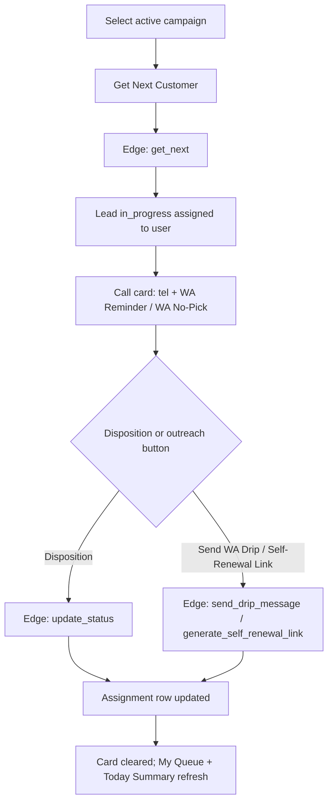

# Insurance Renewal Telecalling — Call Card Workflow & Implementation Status

Last Updated: 2026-07-23  
Owner: Operations Team + Platform Team  
Scope: Telecaller UI on `/insurance-renewal-telecalling` (Call tab, disposition buttons, WA actions)  
Companion: `INSURANCE_RENEWAL_TELECALLING_MODULE_FLOW_AND_BUSINESS_LOGIC.md` (module architecture, tables, admin/cron)

This document is the **operations + engineering truth** for what each call-card control does today, what is supposed to happen, and where code/docs diverge or are broken.

---

## 1) End-to-end telecaller workflow



| Step | What happens |
|------|----------------|
| Campaign | Admin creates rolling window (default 30 days). One row per customer per campaign in `insurance_renewal_assignments`. |
| Get next | Edge `get_next` picks from `status = pending`, applies JS `priority_mode` scoring, sets `in_progress`, `assigned_to` = auth **user UUID**, `assigned_to_name`. |
| Call | `tel:` link. **WA Reminder** / **WA No-Pick** = browser `wa.me` + `log_whatsapp` (no Meta API). |
| Disposition | `update_status` with `assignment_id`, `campaign_id`, `status`, optional `call_notes`, `callback_date`, `quoted_premium`, `renewal_company`. |
| After save | UI clears card; refreshes **My Queue** and **Today's Summary**. |

---

## 2) Status vocabulary and lifecycle

### 2.1 Intended lifecycle

`pending` → (get next) → **`in_progress`** while on call card → terminal disposition **or** retry/callback states.

Legacy RPC path may still set **`assigned`** (email in `assigned_to`) if anything called `insurance_renewal_get_next_assignment` directly — the web app does **not** use that RPC today.

### 2.2 All assignment statuses

| Status | Meaning | Callable via Get Next? | In My Queue? |
|--------|---------|------------------------|--------------|
| `pending` | In pool | Yes | No |
| `in_progress` | On someone's card (web) | No | Yes (if `assigned_to` = you) |
| `assigned` | Legacy/RPC claim | **No** — **orphan risk** | **No** |
| `callback_later` | Scheduled callback | No | Yes |
| `no_answer` | (If persisted) retry state | No | Yes (edge queue filter) |
| `renewed_via_us` | Won via Techwheels | No | No (terminal) |
| `renewed_elsewhere` | Renewed elsewhere | No | Terminal |
| `already_renewed_unknown` | Says renewed; channel unknown | No | Terminal |
| `not_interested` | Declined | No | Terminal |
| `wrong_number` | Bad number | No | Terminal |
| `not_reachable` | Cannot reach | No | Terminal |
| `out_of_window` | Retired by refresh | No | No |

Terminal dispositions count toward campaign **`completed_count`** when `updateCampaignCounts` runs (today: mainly **create/refresh**, not every disposition — see §6).

---

## 3) Call card actions — button by button

Sources: `src/pages/InsuranceRenewalTelecallingPage.tsx` (`CallCard`), `supabase/functions/insurance-renewal-telecalling/index.ts` (`handleUpdateStatus`, drip/link handlers).

### 3.1 Top row (not disposition)

| UI | Edge action | Behavior | Status |
|----|-------------|----------|--------|
| **Call {phone}** | — | `tel:` link | **Working** |
| **WA Reminder** | `log_whatsapp` (`wa_type: renewal_reminder`) | Opens WhatsApp with prefilled reminder text | **Working** |
| **WA No-Pick** | `log_whatsapp` (`wa_type: not_picked`) | Opens WhatsApp with no-pick template | **Working** |

---

### 3.2 ✅ Renewed via Us

| Layer | Detail |
|-------|--------|
| **UI** | Two-step: opens notes + optional **Quoted Premium** / **Renewal Company** → **Confirm Renewed via Us**. |
| **Backend** | `status = renewed_via_us`; saves notes, premium, company; `call_count++`. |
| **Leaderboard** | If `quoted_premium` sent → `renewed_via_us`, `premium_collected`. |
| **Downstream** | Does **not** create policy/booking row (by design). |
| **Status** | **Working** (normal `update_status` path). |

---

### 3.3 🔀 Renewed Elsewhere

| Layer | Detail |
|-------|--------|
| **UI** | Single click; opens notes textarea **and** submits in same click. |
| **Backend** | `renewed_elsewhere`; `call_count++`; leaderboard `renewed_elsewhere++`. |
| **UX quirk** | Notes typed **after** click are **not** saved. Use **Edit** in My Queue or enter notes before clicking. |
| **Status** | **Working** with notes UX quirk. |

---

### 3.4 🔁 Callback Later

| Layer | Detail |
|-------|--------|
| **UI** | Two-step: **Callback Date** required → **Schedule Callback**. |
| **Backend** | `callback_later`, `callback_date`, notes; `call_count++`; leaderboard `callback_later++`; keeps `assigned_to`. |
| **My Queue** | Visible under `callback_later`. |
| **Get Next** | Only picks `pending` — **does not** auto-resurface when `callback_date` is due (documented RPC behavior not implemented in edge `get_next`). |
| **Status** | **Working** for save; **weak** for callback-day routing. |

---

### 3.5 📵 No Answer

| Layer | Detail |
|-------|--------|
| **UI** | One click; toast: retry tomorrow (attempt x/3). |
| **Intended** | `no_answer_count++`, `call_count++`. If &lt; 3: `pending`, `retry_after = tomorrow`, clear assignee, optional Meta drip. If ≥ 3: `not_reachable`. |
| **Actual** | `handleUpdateStatus` **returns success without `.update()`** on the assignment row. Drip may run but DB state unchanged. UI still clears card. |
| **Status** | **Broken** — do not rely on retry cadence or auto-drip from this button until fixed. |

Reference (bug location):

```430:463:supabase/functions/insurance-renewal-telecalling/index.ts
  if (status === "no_answer") {
    // ... builds updateData, may call triggerWhatsAppDrip ...
    return json({
      success: true,
      retry_queued: noAnswerCount < 3,
      no_answer_count: noAnswerCount,
    });
  }
  // DB update only runs below for other statuses
```

**Operator workaround:** use **Not Reachable**, **Callback Later**, or manual **Edit**; or fix edge function (see §7 plan).

---

### 3.6 🚫 Not Reachable

| Layer | Detail |
|-------|--------|
| **UI** | Immediate click; does not open notes first. |
| **Backend** | `not_reachable`; terminal; `call_count++`. |
| **Status** | **Working** (manual terminal). Use instead of 3× No Answer until no-answer fix ships. |

---

### 3.7 ⚠️ Wrong Number

| Layer | Detail |
|-------|--------|
| **UI** | Opens notes + immediate submit (same notes quirk as §3.3). |
| **Backend** | `wrong_number`; terminal; completed bucket. |
| **Status** | **Working**. |

---

### 3.8 😐 Not Interested

| Layer | Detail |
|-------|--------|
| **UI** | Notes quirk (immediate submit). |
| **Backend** | `not_interested`; leaderboard increment. |
| **Status** | **Working**. |

---

### 3.9 🔧 Already Renewed

| Layer | Detail |
|-------|--------|
| **UI** | Label "Already Renewed"; notes quirk. |
| **Backend** | `already_renewed_unknown` — renewed but channel unknown (distinct from Elsewhere / Via Us). |
| **Status** | **Working**. |

---

### 3.10 💬 Send WA Drip

| Layer | Detail |
|-------|--------|
| **UI** | Calls `send_drip_message` (independent of disposition). |
| **Requires** | Campaign `meta_enabled` + `drip_enabled`; global Meta in `wa_agent_config`. |
| **Behavior** | Step = `min(no_answer_count, 3)` (defaults to step 1 if never no-answered). Meta template send; log `insurance_renewal_meta_logs`; set `whatsapp_sent`, `whatsapp_status = drip_step_N`. Step 3 may create self-renewal link if `self_renewal_link_enabled`. |
| **Status** | **Conditional** — works only with Meta configured; fails with clear error if disabled. |

---

### 3.11 🔗 Self-Renewal Link

| Layer | Detail |
|-------|--------|
| **UI** | `generate_self_renewal_link`; copies URL to clipboard. |
| **Backend** | Insert `insurance_renewal_self_renewal_links`; token; 30-day expiry; URL `https://techwheels-service.vercel.app/insurance-renewal/self?token=…` |
| **Gaps** | No `/insurance-renewal/self` route in `src/App.tsx` (customer page may 404). `self_renewal_link_enabled` defaults **false**. Does not send WA by itself. |
| **Status** | **Partial** — link row created; landing TBD. |

---

## 4) Operator mental model

| Goal | Use |
|------|-----|
| **Success + premium** | ✅ Renewed via Us |
| **Lost / closed** | 🔀 Elsewhere, 🔧 Already Renewed, 😐 Not Interested, ⚠️ Wrong Number, 🚫 Not Reachable |
| **Follow up** | 🔁 Callback Later (track in **My Queue**) |
| **Retry tomorrow + drip** | 📵 No Answer — **broken**; use Callback or Not Reachable until fix |
| **Outreach without disposition** | WA Reminder / WA No-Pick; 💬 Send WA Drip (Meta); 🔗 Self-Renewal Link |

---

## 5) My Queue, summary, admin counters

| Feature | Intended | Actual |
|---------|----------|--------|
| **My Queue** | Active work for telecaller | `assigned_to` = user id AND status ∈ `in_progress`, `callback_later`, `no_answer` — **excludes `assigned`** |
| **Today's Summary** | Counts by disposition today | `my_summary` missing `not_reachable`, `wrong_number`, `already_renewed_unknown` — UI cards may show 0/undefined |
| **Campaign counters** | Reflect live assignment mix | Updated on **create/refresh** via `updateCampaignCounts`, **not** after each `update_status` |
| **Stuck leads** | — | Rows in `assigned` with email assignee: not in Get Next (pending only) nor My Queue — requires SQL reset (see §8) |

---

## 6) Implementation vs design (module-level gaps)

Compared to `INSURANCE_RENEWAL_TELECALLING_MODULE_FLOW_AND_BUSINESS_LOGIC.md` (as-designed) and service **Telecalling** edge function (reference implementation).

| Area | As-designed / doc | As-implemented | State |
|------|-------------------|----------------|-------|
| **get_next** | RPC `insurance_renewal_get_next_assignment`; callbacks due today first; status `assigned`; email in `assigned_to` | JS priority on `pending` only; status `in_progress`; UUID in `assigned_to` | **Diverged** |
| **Eligibility (create/refresh/preview)** | `insurance_renewal_leads.effective_due_date` | Edge still filters `last_insurance_expiry_date IS NOT NULL` on `all_service_data` | **Diverged** — explains large `out_of_window` vs small `pending` pools |
| **no_answer** | 3-strike retry + drip | Early return, no DB update | **Broken** |
| **Callback due date** | Prefer callbacks on due date in get_next | Not implemented | **Missing** |
| **Campaign counts after call** | Derived after each update (doc §8.6) | Only create/refresh | **Stale counters** |
| **DB writes** | Service role (telecalling pattern) | User JWT + anon client | **RLS-dependent** — telecaller writes need policies beyond SELECT (production may have admin-only write policy) |
| **Meta drip / self-renewal / leaderboard / RC fetch** | Enhancement migration | Present in edge function | **Partial** (Meta/route flags) |

---

## 7) Remediation plan (engineering)

Priority order for a focused PR:

1. **Fix `no_answer` in `handleUpdateStatus`** — persist `.update()` before return; on 3rd strike set `not_reachable`; call `updateCampaignCounts` (optional leaderboard).
2. **Align `get_next` with RPC** — call `insurance_renewal_get_next_assignment(campaign_id, user_email)` OR replicate: retry-due `pending`, then fresh `pending`, `effective_due_date` order; normalize status (`in_progress` vs `assigned`) in one convention.
3. **Callback resurfacing** — before pending pick: `callback_later` where `callback_date <= today` and `assigned_to` = current user (or team pool — product decision).
4. **Refresh/create/preview** — query `insurance_renewal_leads` / `effective_due_date` instead of raw `last_insurance_expiry_date` only.
5. **`updateCampaignCounts` after `update_status`** — match service telecalling.
6. **Service role for mutations** — validate JWT, then use service client for writes (telecalling pattern).
7. **UI notes** — two-step confirm for Elsewhere / Wrong # / Not Interested / Already Renewed (match Renewed via Us).
8. **`my_summary`** — add missing disposition counts.
9. **Self-renewal** — add `/insurance-renewal/self` route or change URL to existing page.
10. **Docs sync** — update main module doc §6.5, §7, §8 when above land.

---

## 8) Ops: reset stuck assignments (SQL)

When counts show `assigned` / `in_progress` but telecallers cannot see leads:

```sql
UPDATE public.insurance_renewal_assignments
SET status = 'pending', assigned_to = NULL, assigned_to_name = NULL,
    assigned_at = NULL, updated_at = NOW()
WHERE campaign_id = :campaign_id
  AND status IN ('assigned', 'in_progress');
```

Then recount campaign columns from assignment statuses (see ops runbook in chat / SQL in platform notes).

**Callable pool** = `status = 'pending' AND assigned_to IS NULL`. Rows in `out_of_window` are not revived by this reset.

---

## 9) Sync contract

Update this file when:

1. Any call-card button wiring or disposition changes in `InsuranceRenewalTelecallingPage.tsx`.
2. `handleUpdateStatus`, `handleGetNext`, drip/link handlers change.
3. A item in §6 moves from Broken/Diverged to Working.

Also update `INSURANCE_RENEWAL_TELECALLING_MODULE_FLOW_AND_BUSINESS_LOGIC.md` change log and `docs/shared/active/CHANGE_LOG.md`.

```bash
rg -n "CallCard|update_status|handleGetNext|send_drip_message|generate_self_renewal" \
  src/pages/InsuranceRenewalTelecallingPage.tsx supabase/functions/insurance-renewal-telecalling/
```

---

## 10) Change log

1. **2026-07-23:** Initial call-card workflow, per-button status, known bugs (no_answer, get_next/RPC, refresh eligibility), ops SQL reset, remediation plan.
