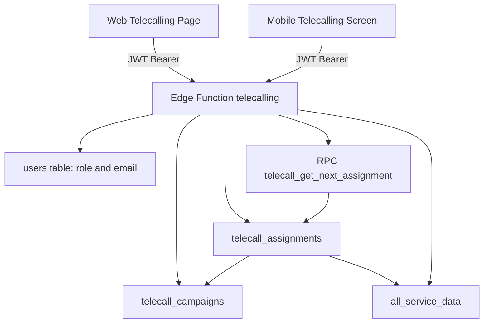

# OPS-TELECALL-001: Telecalling Module Flow and Business Logic

Last Updated: 2026-06-23
Owner: Operations Team + Platform Team
Scope: Web route /telecalling, shared Supabase edge function, and mobile parity screen
Status: Active operations authority for module behavior

---

## 1) Purpose

This document is the single operational reference for the Telecalling module.

Use this file to understand:
1. End-to-end flow from UI to edge function to database.
2. Business rules for assignment, call outcomes, and campaign stats.
3. Role access behavior for web and mobile.
4. What must be updated when this module changes in future.

---

## 2) Source of Truth Map

Application sources:
1. `src/pages/TelecallingPage.tsx`
2. `mobile/src/app/(tabs)/telecalling.tsx`
3. `supabase/functions/telecalling/index.ts`
4. `src/App.tsx` (web route and module access gate)

Authoritative database/schema sources:
1. `local_folder/backups/full_database.sql` (authoritative dump)
2. `local_folder/backups/chunks/full_database.sql.part_000` (table/function DDL mirror)
3. `local_folder/backups/chunks/full_database.sql.part_004` (constraints/indexes/FKs/RLS mirror)

---

## 3) Module Goal

Telecalling is a service-reminder workflow that:
1. Creates date-range campaigns from customers due for service.
2. Assigns leads to telecallers one-by-one via an atomic picker.
3. Captures call outcomes and follow-up dates.
4. Tracks campaign performance and daily telecaller summary.

---

## 4) End-to-End Architecture



---

## 5) Access and Roles

### 5.1 Web route access

Route `/telecalling` is gated by module name `telecalling` in `src/App.tsx`.

Access rules:
1. Users need `telecalling` in `get_all_my_permissions()` result.
2. Admin gets broad access through admin handling in app-level permission loading.

### 5.2 In-page role behavior

Inside Telecalling page:
1. User role is read from `users.role`.
2. `admin` sees Admin Dashboard and Telecaller View toggle.
3. Non-admin users see Telecaller dashboard only.

### 5.3 Edge authorization

Each edge call requires bearer token.
1. Token is validated with Supabase auth client.
2. User identity is resolved to `users.email` and `users.role`.
3. Admin-only actions are enforced server-side (`create_campaign`, `campaign_stats`, `close_campaign`).

---

## 6) Data Model (Authoritative)

### 6.1 Lead source table

`all_service_data` is the lead source.
Important fields used by Telecalling:
1. `id`
2. `contact_phones`
3. `assumed_next_service_date`
4. `assumed_next_service_type`
5. Customer identity and vehicle fields (`first_name`, `last_name`, `model`, `vehicle_registration_number`, etc.)

### 6.2 Campaign table

Table: `telecall_campaigns`

Core columns:
1. `id`
2. `campaign_name`
3. `date_from`, `date_to`
4. `status` (default `active`)
5. counters: `total_leads`, `pending_count`, `completed_count`, `booked_count`, `whatsapp_sent_count`
6. audit fields: `created_by`, `created_at`, `updated_at`

### 6.3 Assignment table

Table: `telecall_assignments`

Core columns:
1. `id`, `campaign_id`, `customer_id`
2. `assigned_to` (user email)
3. `status` (default `pending`)
4. call outcome fields: `call_notes`, `booking_date`, `callback_date`, `called_at`
5. counters: `call_count`, `no_answer_count`
6. WhatsApp fields: `whatsapp_sent`, `whatsapp_status`
7. timestamps: `assigned_at`, `updated_at`

### 6.4 Key constraints and relationships

From authoritative schema mirror:
1. Unique: `(campaign_id, customer_id)` on `telecall_assignments`
2. FK: `telecall_assignments.campaign_id -> telecall_campaigns.id` (cascade delete)
3. FK: `telecall_assignments.customer_id -> all_service_data.id` (cascade delete)

### 6.5 RPC used for concurrency-safe assignment

Function: `telecall_get_next_assignment(p_campaign_id, p_user_email)`

Behavior:
1. Select first unassigned `pending` row ordered by assignment id.
2. Lock row with `FOR UPDATE SKIP LOCKED`.
3. Update row to `assigned` and set `assigned_to`, `assigned_at`, `updated_at`.
4. Return `(assignment_id, customer_id)`.

---

## 7) API Actions in Edge Function

Endpoint: Supabase edge function `telecalling`

### 7.1 `create_campaign` (admin only)

Input:
1. `campaign_name`
2. `date_from`
3. `date_to`

Logic:
1. Insert campaign with status `active`.
2. Query `all_service_data` where:
   - `assumed_next_service_date` in range
   - `contact_phones` is not null
3. Insert one `pending` assignment per eligible customer.
4. Update campaign counters (`total_leads`, `pending_count`).

### 7.2 `get_next`

Input:
1. `campaign_id`

Logic:
1. Call RPC `telecall_get_next_assignment`.
2. If no row is available, return `assignment: null`.
3. Else fetch full customer details from `all_service_data` and return assignment payload.

### 7.3 `update_status`

Input:
1. `assignment_id`
2. `campaign_id`
3. `status`
4. optional `call_notes`, `booking_date`, `callback_date`

Logic:
1. Set `called_at` and `updated_at`.
2. Increment `call_count`.
3. If status is `no_answer`, increment `no_answer_count`.
4. If `no_answer_count >= 3`, status is auto-changed to `not_reachable`.
5. Recompute campaign counters from all assignments in campaign:
   - `pending_count`: statuses in `pending`, `assigned`, `calling`
   - `completed_count`: statuses in `completed`, `no_answer`, `not_reachable`, `wrong_number`, `not_interested`
   - `booked_count`: status `booked`

### 7.4 `my_queue`

Input:
1. optional `campaign_id`

Logic:
1. Filter assignments where `assigned_to` = current user email.
2. Include statuses: `assigned`, `calling`, `callback_later`, `booked`.
3. Return joined customer summary fields.

### 7.5 `my_summary`

Logic:
1. Filter assignments for current user where `called_at` is today (UTC day boundary logic in current implementation).
2. Return status bucket counts for dashboard cards.

### 7.6 `campaign_stats` (admin only)

Logic:
1. Return campaign list.
2. Build telecaller status distribution by `assigned_to`.
3. Return booked assignments list for recent bookings panel.

### 7.7 `close_campaign` (admin only)

Input:
1. `campaign_id`

Logic:
1. Set campaign `status = closed`.

---

## 8) Web UI Flow

### 8.1 Initialization

1. Resolve current session.
2. Load role from `users` table.
3. Load campaigns ordered by newest first.
4. Select active campaign if present, else latest campaign.

### 8.2 Telecaller dashboard

Views:
1. Call view
2. My Queue view
3. Today Summary view

Primary journey:
1. Telecaller clicks Get Next Customer.
2. System returns one assignment.
3. Telecaller calls customer and sets outcome.
4. Queue and summary refresh after status update.

### 8.3 Admin dashboard

Capabilities:
1. Create campaign with date range.
2. Close active campaign.
3. Monitor campaign counters.
4. View telecaller performance table.
5. View recent booked customers.

---

## 9) Mobile Flow Parity

Mobile screen mirrors core flow:
1. Same edge endpoint and action contract.
2. Same campaign loading and active campaign selection.
3. Same call/queue/summary tabs.
4. Native call launch via `tel:` URL using device dialer.

Notable differences:
1. Mobile uses modals for booking and callback dates.
2. Mobile has no admin campaign-creation surface in this screen.

---

## 10) Business Rules Summary

1. Campaign lead eligibility requires due-date in range and phone availability.
2. One customer appears once per campaign due to unique `(campaign_id, customer_id)`.
3. Assignment is pull-based and atomic, preventing duplicate pickup under concurrency.
4. Three consecutive `no_answer` updates auto-transition assignment to `not_reachable`.
5. Booked visits must include `booking_date`; callback flow must include `callback_date`.
6. Campaign counters are derived from assignment statuses after each update.

---

## 11) Observed Current Constraints and Risks

1. `my_summary` uses UTC-day boundary in current edge code; IST-based business reporting may drift near day cutoffs.
2. `campaign_stats` telecaller breakdown currently aggregates across assignments without explicit campaign filter in code path.
3. Status vocabulary is flexible text; without stricter enum/validation, unexpected status values can skew counters.

These are implementation facts, not blockers for current production behavior.

---

## 12) Sync Contract (Mandatory for Future Changes)

This file must be updated in the same change whenever any of the following changes:

1. New or removed edge action in `supabase/functions/telecalling/index.ts`.
2. Status lifecycle changes (new statuses, counter rules, auto-transition logic).
3. Schema changes to `telecall_campaigns`, `telecall_assignments`, or lead-source fields from `all_service_data`.
4. Access-control changes for `/telecalling` route or module permissions.
5. Mobile/web parity behavior differences introduced intentionally.

### 12.1 Required update checklist

1. Update sections 6, 7, and 10 in this file.
2. Add a dated entry to section 13 change log.
3. Update operations indexes/trackers:
   - `docs/Implementation_plans/webversion/INDEX.md`
   - `docs/Implementation_plans/webversion/IMPLEMENTATION_TRACKER.md`
4. Validate references with search:

```bash
rg -n "telecall_|telecalling|OPS-TELECALL-001" src mobile/src supabase/functions docs/Implementation_plans
```

### 12.2 Drift audit command (recommended)

```bash
rg -n "action === '" supabase/functions/telecalling/index.ts
```

Compare action list from command output with section 7 before closing change.

---

## 13) Change Log

1. 2026-06-23: Initial full-flow baseline created from web/mobile source code, edge function, and authoritative schema dump mirror.
2. 2026-06-23: Classified under web operations category as per docs tree governance.
